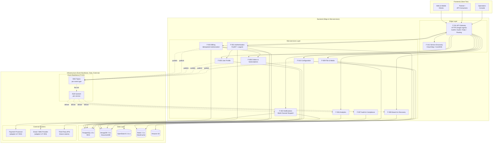
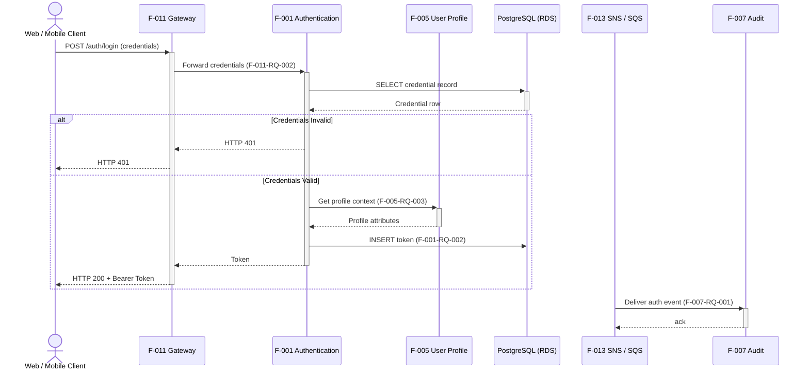
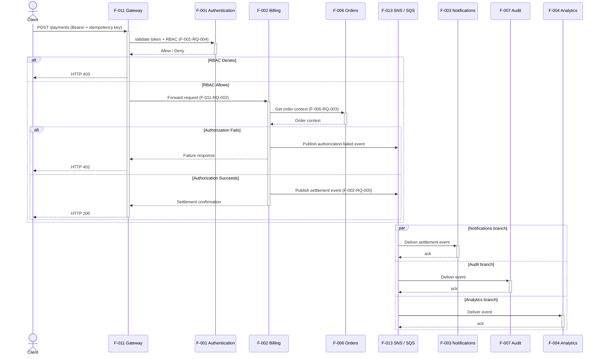

# Technical Specification

# 0. Agent Action Plan

## 0.1 Intent Clarification

### 0.1.1 Core Feature Objective

Based on the prompt, the Blitzy platform understands that the new feature requirement is to author a comprehensive, standalone documentation deliverable consisting of Mermaid-formatted diagrams that visualize the architecture of the platform's large-scale microservices system. The deliverable is markdown content (not application code) that is committed to the repository, rendered by GitHub/GitLab/IDEs, and serves as the canonical, viewable architectural illustration of the platform.

The user's enumerated requirements translate into the following discrete, technically precise objectives:

- A single highly detailed **architecture diagram** in Mermaid `flowchart`/`graph` form that visualizes ten or more first-class services. The user-named exemplars (Auth, API Gateway, User, Billing, Notifications, Analytics, Search) map one-to-one onto the existing Feature Catalog of Section 2.1.2 — F-011 API Gateway, F-001 Authentication, F-005 User Profile, F-002 Billing, F-003 Notifications, F-004 Analytics, F-008 Search & Discovery — augmented by the remaining services in the catalog (F-006 Orders & Subscriptions, F-007 Audit & Compliance, F-009 File & Media, F-010 Configuration), comfortably exceeding the "10+" floor.
- Communication topology that simultaneously expresses **synchronous REST/HTTPS** edges and **asynchronous messaging** edges, with visually distinct edge styles (solid for synchronous, dotted for asynchronous publish/subscribe). This maps onto the existing two-pathway integration mandate of Section 6.3.1: HTTPS through F-011 for synchronous traffic and SNS+SQS through F-013 for asynchronous fan-out.
- A **dedicated database node per service** rendered as cylinder shapes (`[(...)]`), preserving the database-per-service mandate (ADR-011) and the polyglot persistence binding of Section 5.1.2.1 (PostgreSQL for F-001, F-002, F-005, F-006, F-010; MongoDB/DocumentDB for F-003, F-004, F-007, F-009; OpenSearch for F-008; Redis cache for F-001 and F-010; S3 for F-009 payloads).
- **External systems** rendered as terminal nodes outside the platform boundary, including a payment gateway (consumed by F-002), an email/SMS service (consumed by F-003), and a generic third-party API category. These align with the adapter-seam strategy of Section 3.4.2 and Section 6.3.4.1.
- **Subgraph grouping** along the requested frontend / backend / infra axis. The Blitzy platform interprets this as the canonical layered grouping documented throughout the Technical Specification: a Client tier representing frontend consumers, a Backend tier comprising the Edge Layer plus all microservices, and an Infrastructure tier encompassing the Event Backbone, the Data Layer, and the External Systems boundary.
- **Bidirectional and conditional flows**, materialized as request/response double-headed edges where appropriate (`<-->` syntax) and as conditional/decision flows in the sequence diagrams (`alt`/`else` blocks per the Mermaid sequence-diagram grammar of Section 4.3 and Section 5.2.7).
- **Long node labels and annotations**, achieved through multi-line node labels using the `<br/>` line-break convention and Mermaid `%%`-prefixed comments, mirroring the labeling style used throughout the Technical Specification (e.g., `"F-011 API Gateway<br/>(Single Ingress)"`).
- **Dense, interconnected** topology. The Blitzy platform interprets density as the full enumeration of every architecturally permitted edge in Section 5.1.3.2 (client → gateway, gateway → ten services, gateway → discovery, three permitted service-to-service synchronous edges F-001→F-005 / F-002→F-006 / service→F-010, every publisher → SNS, SNS → every per-service SQS queue, SQS → universal subscribers F-003/F-004/F-007/F-008, every service → its persistence engine, applicable services → their external adapter seams, observability fan-out from every service → CloudWatch/X-Ray).
- A minimum of **two Mermaid sequence diagrams** for the Login flow and the Payment processing flow. The Blitzy platform commits to producing both, modeled on the canonical sequence diagrams already encoded at Sections 4.3.1, 4.3.2, 5.2.7.1, 5.2.7.2, and 6.3.5.1, 6.3.5.2 — but enhanced to satisfy the user's specific decorative requirements (long labels, annotations, conditional `alt`/`else` blocks).

Implicit requirements surfaced by the prompt include: GitHub-flavored Markdown compatibility for ```mermaid fenced code blocks (the de-facto rendering target); diagram organization into a discoverable `docs/` folder; cross-linking from `README.md` so that the diagrams are reachable from the repository's landing page; alignment of every node label, service identifier, and database engine with the canonical names already established in Sections 2.1, 5.1, and 5.2 of the Technical Specification so that the diagrams are not contradictory with the rest of the document.

Feature dependencies and prerequisites are minimal: Mermaid is a text-based diagram description language interpreted at render time by Markdown viewers (GitHub, GitLab, IntelliJ, VS Code Mermaid extension, Mermaid Live Editor). No application runtime, no package install, and no build step is required for the deliverable to function. Optional validation can be performed using `@mermaid-js/mermaid-cli` (the `mmdc` binary) to verify that each diagram parses cleanly, but this is a developer-side quality check, not a production dependency.

### 0.1.2 Special Instructions and Constraints

The user's prompt enumerates a set of decorative and topological constraints that the Blitzy platform must capture verbatim and translate into Mermaid syntax decisions:

- **User Example: "Include 10+ services (Auth, API Gateway, User, Billing, Notifications, Analytics, Search, etc.)"** — interpreted as a minimum-cardinality constraint that the architecture diagram must depict at least eleven distinct service nodes (the seven named plus the four remaining catalog services F-006 Orders, F-007 Audit, F-009 File & Media, F-010 Configuration), satisfying the "10+" floor with margin and matching the Feature Catalog of Section 2.1.2 exactly.
- **User Example: "Show communication between services (REST + async messaging)"** — interpreted as a dual-channel rendering mandate: solid edges for HTTPS REST traffic transiting F-011, dotted edges for SNS publish and SQS deliver paths via F-013. Edge labels must call out the protocol or library where appropriate (e.g., `httpx`, `boto3 publish`, `at-least-once`).
- **User Example: "Include databases for each service"** — interpreted as a one-to-one binding between every microservice node and at least one persistence node, drawn with the cylindrical `[(name)]` shape per Mermaid grammar. Services that consume more than one engine (F-001 PostgreSQL + Redis; F-009 MongoDB + S3; F-010 PostgreSQL + Redis) must show every binding.
- **User Example: "Add external systems (payment gateway, email service, third-party APIs)"** — interpreted as an out-of-platform `ExternalSystems` subgraph containing at minimum: a "Payment Processor" terminal node connected to F-002, an "Email/SMS Provider" terminal node connected to F-003, and a generic "Third-Party APIs" terminal node connected via the adapter-seam pattern. Per Section 1.3.2.1, no specific vendor is named — these are illustrative placeholders for the adapter seams of Section 6.3.4.1.
- **User Example: "Use subgraphs for grouping (frontend, backend, infra)"** — interpreted as exactly three first-class subgraphs at the top level of the architecture diagram, plus optional nested subgraphs inside `Infrastructure` for the Event Backbone, Data Layer, and External Systems. Each subgraph is given a quoted human-readable label per Mermaid 11.x convention (e.g., `subgraph Backend["Backend - Edge & Microservices"]`).
- **User Example: "Include bidirectional and conditional flows"** — interpreted as: in the architecture diagram, render at least one bidirectional `<-->` edge to depict request/response symmetry where the synchronous round-trip is a meaningful annotation (e.g., F-011 ↔ F-001 token validation); in the sequence diagrams, render explicit `alt`/`else` decision branches for credential-validity outcomes and authorization-success outcomes.
- **User Example: "Add long node labels and annotations"** — interpreted as multi-line node labels using `<br/>` line breaks (e.g., `"F-002 Billing<br/>Plans, Invoices,<br/>Idempotent Authorization,<br/>Settlement"`) and Mermaid comments (`%% ...`) immediately preceding each subgraph or major edge cluster to document its architectural intent.
- **User Example: "Ensure connections are dense and interconnected"** — interpreted as the requirement to draw every architecturally permitted edge enumerated in Section 5.1.3.2, plus the universal-subscriber fan-out of Section 6.3.3.1.1, plus the bootstrap dependency on F-010 from every other service. The diagram is expected to be visually busy by design.
- **User Example: "Also include at least 2 sequence diagrams for key flows like login and payment processing."** — interpreted as a hard floor of two sequence diagrams; the deliverable will produce exactly the two named flows, each in its own fenced ```mermaid sequenceDiagram code block, sized to be self-contained and individually renderable.

Architectural and conventional constraints derived from the broader Technical Specification:

- **Naming alignment** — every service node label must use the canonical `F-XXX` identifier and feature name as established in Section 2.1.2. Deviation from canonical naming would create a documentation inconsistency relative to Sections 5.1, 5.2, 6.1, 6.3, and 9.1.
- **Mermaid syntax compatibility** — the deliverable targets Mermaid 11.x grammar (the current stable line per the npm `mermaid` package), specifically using `flowchart TB`/`flowchart LR` declarations, double-quoted node labels for safe handling of special characters, `<br/>` for line breaks, `[(...)]` for cylinder/database nodes, `{{...}}` or `[/.../]` for distinctive shape annotations on queues/topics, dotted-line `-. label .->` syntax for asynchronous edges, and `sequenceDiagram` with `participant`, `actor`, `alt`/`else`/`end`, `loop`, `par`/`and`/`end`, and `Note over` blocks for the sequence diagrams.
- **No collisions with reserved Mermaid tokens** — node identifiers must not collide with Mermaid reserved words, and label text containing problematic characters (`#`, `(`, `)`, colons) must be enclosed in double quotes per the Mermaid syntax guidance.
- **Render-target portability** — the diagrams must render correctly in GitHub-flavored Markdown without requiring custom renderers; Mermaid syntax-level features that depend on themes, configuration directives (`%%{init: ...}%%`), or experimental layout engines (e.g., ELK) are avoided unless universally supported.

Web search requirements: research has been conducted to confirm Mermaid's current stable release (11.14.0 on npm as of April 2026), to verify subgraph syntax compatibility for nested layouts, and to validate the canonical sequence-diagram grammar for `alt`/`else`, `loop`, and `par` blocks. No further external research is required for the deliverable.

### 0.1.3 Technical Interpretation

These feature requirements translate to the following technical implementation strategy:

- To produce a comprehensive Mermaid architecture diagram that satisfies the 10+ services, REST + async messaging, per-service databases, external systems, subgraph grouping, bidirectional and conditional flows, long labels, and dense interconnection requirements, the Blitzy platform will create a new markdown documentation file at `docs/architecture/microservices-architecture.md` containing one or more fenced ```mermaid flowchart code blocks. The primary diagram will use `flowchart TB` orientation with three top-level subgraphs (`Frontend`, `Backend`, `Infrastructure`) and nested subgraphs inside `Backend` for the Edge Layer and the Microservices Layer, and inside `Infrastructure` for the Event Backbone, the Data Layer, and the External Systems boundary.
- To produce the two mandated sequence diagrams (login and payment processing), the Blitzy platform will create two additional markdown documentation files at `docs/architecture/sequence-diagrams/login-flow.md` and `docs/architecture/sequence-diagrams/payment-flow.md`, each containing one fenced ```mermaid sequenceDiagram code block. Each sequence diagram will declare every participant by canonical `F-XXX` name (per Section 5.2.7), use `actor` for the human Client, render the synchronous request/response pattern with activation/deactivation arrows (`->>+` and `-->>-`), and use `alt`/`else`/`end` blocks for the credential-valid/credential-invalid branch in Login and the RBAC-allow/RBAC-deny + authorization-succeeds/authorization-fails branches in Payment, plus a `par`/`and`/`end` block for the parallel Notifications/Audit/Analytics fan-out following settlement in Payment.
- To fulfil the "dense, interconnected" requirement without producing an unreadable diagram, the Blitzy platform will additionally provide one or more **complementary detail diagrams** in the same architecture file: an "Event Bus Fan-Out" subdiagram showing per-publisher-to-per-subscriber routing through SNS topics and SQS queues, and a "Per-Boundary Resilience" annotation showing where `tenacity` retry, `circuitbreaker`, and idempotency policies wrap each integration edge. These complementary diagrams refine specific concerns without overloading the primary architecture diagram.
- To anchor the new documentation in the repository's discoverability surface, the Blitzy platform will modify `README.md` to add a top-level "Architecture Documentation" section linking to `docs/architecture/microservices-architecture.md` and to each of the two sequence-diagram files. The existing single-line `# 29April_7` heading will be preserved; new content will be appended, not replaced.
- To guarantee that each Mermaid block is syntactically valid and renders without errors on GitHub, the Blitzy platform will adopt three syntactic disciplines uniformly across all created files: every node label that contains punctuation or whitespace will be wrapped in double quotes; every multi-line label will use `<br/>` for line breaks; every subgraph label will use the `subgraph Id["Display Name"]` form; every dotted (asynchronous) edge will use the `-. label .->` form to differentiate it visually from synchronous solid edges; every diagram will declare its direction explicitly (`flowchart TB`, `flowchart LR`, or `sequenceDiagram` as appropriate).
- To ensure the diagrams remain authoritative and do not drift from the rest of the Technical Specification, every service identifier, persistence-engine name, library name, and event-flow path used in the new documentation will be drawn from the canonical sources: Section 2.1.2 (Feature Catalog), Section 5.1.2.1 (Domain Microservices — Identity), Section 5.1.3.2 (Integration Patterns), Section 6.3.3.1.1 (Event Topology), and Section 9.1.6 (Open-Source Dependency Inventory).

## 0.2 Repository Scope Discovery

### 0.2.1 Comprehensive File Analysis

The repository on which this Agent Action Plan operates is in a **greenfield, near-empty state**. A full inspection of the repository root reveals exactly two artifacts: the `README.md` file (containing a single line, `# 29April_7`) and the hidden `.git/` metadata directory created by the version-control tooling. There is no `src/`, `lib/`, `app/`, `docs/`, `frontend/`, `backend/`, `tests/`, `migrations/`, `config/`, `.github/`, or any other directory; there is no `package.json`, `requirements.txt`, `pyproject.toml`, `tox.ini`, `Dockerfile`, `docker-compose.yml`, `Makefile`, or any other dependency manifest, build descriptor, or CI configuration; there is no `.blitzyignore` file present anywhere in the tree.

Because the repository contains no application code, no integration source files, no service modules, no test files, no build descriptors, no dependency manifests, no API definitions, no schema/migration files, and no existing documentation beyond the one-line `README.md`, the entire body of "existing files to modify" reduces to a single file. There are no existing modules, classes, controllers, middleware, models, or routes that this feature could ripple into; there is no schema to migrate, no service to register, no dependency-injection container to wire. The implementation is therefore a **pure documentation addition** with one minor existing-file modification (the `README.md`).

The following table enumerates the affected existing files exhaustively:

| File Path | Status | Action | Purpose |
|---|---|---|---|
| `README.md` | Existing (single-line placeholder) | Modify | Append a discoverability section linking to the new architecture documentation files; preserve the existing `# 29April_7` heading |

Search-pattern-based file groups examined to confirm exhaustive scope:

| Search Pattern | Result | Implication |
|---|---|---|
| `src/**/*.py`, `lib/**/*.js`, `app/**/*.rb` | No matches (no source directories exist) | No source modules to modify |
| `**/*test*.py`, `**/*spec*.js`, `test/**/*` | No matches | No existing tests to update |
| `**/*.config.*`, `**/*.json`, `**/*.yaml`, `**/*.toml` | No matches | No configuration to modify |
| `**/*.md`, `docs/**/*` | Only `README.md` matches | Single existing markdown asset; new docs to be created |
| `Dockerfile*`, `docker-compose*`, `.github/workflows/*`, `**/pom.xml` | No matches | No build/deploy assets to modify |
| `**/*.proto`, `**/openapi*.yaml`, `**/swagger*.json` | No matches | No API contracts to update |
| `**/migrations/**`, `**/schema*.sql` | No matches | No persistence schema to modify |
| `**/.env*`, `**/secrets*` | No matches | No secrets/environment files to update |
| `**/.blitzyignore` | No matches anywhere in tree | No path-exclusion patterns to honor |

Integration-point discovery is correspondingly minimal:

- **API endpoints**: none — no API code exists
- **Database models / migrations**: none — no persistence code exists
- **Service classes**: none — no service implementations exist
- **Controllers / handlers**: none — no HTTP handlers exist
- **Middleware / interceptors**: none — no middleware exists
- **Existing documentation**: only `README.md` exists, with one heading and no body

This finding is consistent with — and confirmed by — Section 7.1.1 ("the repository on which this specification is based is in a greenfield state — its only artifact is a `README.md` containing the project name") and the references catalog of Section 6.3.8.1 ("`README.md` — Confirmed greenfield repository state … no implementation code, configuration, or build artifacts exist").

### 0.2.2 Web Search Research Conducted

To validate the technical choices for the deliverable, the following targeted web research was performed:

- **Best practices for authoring Mermaid architecture diagrams** — confirmed the current stable release of Mermaid is `11.14.0` on the npm registry (last published April 2026) and that the `@mermaid-js/mermaid-cli` (`mmdc`) tool is at `11.12.0`. Confirmed that GitHub-flavored Markdown natively renders fenced ```mermaid``` code blocks for both flowchart/graph and sequenceDiagram types.
- **Subgraph syntax for grouping** — confirmed the `subgraph Id["Display Label"] ... end` form is supported in Mermaid 11.x, and that nested subgraphs (subgraph within subgraph) render correctly. Confirmed that the `direction` keyword inside a subgraph (e.g., `direction LR`) is supported but is ignored when any subgraph node has an external link, in which case the parent diagram direction is inherited.
- **Conditional and bidirectional flow patterns** — confirmed bidirectional edges via `<-->` syntax in flowcharts and conditional `alt`/`else`/`end` plus `par`/`and`/`end` plus `loop`/`end` blocks in sequence diagrams are first-class, version-stable features.
- **Long labels and annotations** — confirmed multi-line labels via `<br/>` line breaks inside double-quoted label strings, plus comment annotations via `%%`-prefixed lines, are first-class features. Confirmed that markdown formatting strings (bold/italic via `**` and `*`) are also available in modern Mermaid but require markdown-string mode and are therefore avoided in favor of plain `<br/>` for portability.
- **Reserved-word and special-character hazards** — confirmed that the lowercase word `end` cannot be used as a node identifier in flowcharts (it terminates a subgraph block), and that nodes whose label begins with the letter `o` or `x` after a connection like `A---oB` are interpreted as circle/cross edges; node identifiers used in this deliverable will therefore be uppercase short codes (e.g., `F1`, `F2`, `Web`, `MQ`) and labels will be quoted.
- **Library recommendations for diagram-as-code** — Mermaid was selected by the user prompt itself and is reaffirmed by the Technical Specification's Section 6.3.2.6 ("Architecture diagrams: Mermaid diagrams for all flows and topologies"). No alternative library (PlantUML, D2, Excalidraw) is in scope.

### 0.2.3 New File Requirements

The deliverable creates a new top-level `docs/` documentation tree with a clean, discoverable hierarchy. The exhaustive inventory of new files is:

| New File Path | Purpose |
|---|---|
| `docs/architecture/microservices-architecture.md` | Primary deliverable: comprehensive Mermaid architecture diagram with frontend/backend/infrastructure subgraphs; ten-plus services; per-service databases; SNS+SQS event backbone; external systems (payment processor, email/SMS provider, third-party APIs); bidirectional and conditional edges; long node labels; dense interconnection. Includes complementary "Event Bus Fan-Out" and "Per-Boundary Resilience" subdiagrams. |
| `docs/architecture/sequence-diagrams/login-flow.md` | Mermaid sequence diagram for the Login flow; covers Client → F-011 Gateway → F-012 Discovery → F-001 Authentication → F-005 User Profile interaction with `alt`/`else` branches for credential validity, plus asynchronous fan-out to F-007 Audit through F-013. Aligned with Section 4.3.1 / Section 5.2.7.1. |
| `docs/architecture/sequence-diagrams/payment-flow.md` | Mermaid sequence diagram for the Payment processing flow; covers Client → F-011 → F-001 token validation → F-002 Billing → F-006 Orders, with `alt`/`else` branches for RBAC permit/deny and authorization succeed/fail, plus a `par`/`and`/`end` block for parallel fan-out to F-003 Notifications, F-007 Audit, and F-004 Analytics. Aligned with Section 4.3.2 / Section 5.2.7.2. |
| `docs/architecture/README.md` | Index page for the architecture documentation tree; lists the architecture diagram and each sequence-diagram file with one-line descriptions; provides a single landing page for readers entering the `docs/architecture/` directory. |

No new source files, no new test files, no new configuration files, and no new schema or migration files are created. The deliverable is purely documentation. There is no `src/`, no `tests/`, no `config/`, no `migrations/` to populate.

The folder hierarchy created by this deliverable, expressed as an indented outline, is:

- `docs/`
    - `architecture/`
        - `README.md` — index page for the architecture documentation tree
        - `microservices-architecture.md` — primary architecture diagram document
        - `sequence-diagrams/`
            - `login-flow.md` — login sequence diagram
            - `payment-flow.md` — payment sequence diagram

This structure separates the primary architecture diagram from the sequence-diagram set so that each concern is independently navigable, and it follows the conventional `docs/<topic>/<sub-topic>/` pattern used in mature open-source repositories.

## 0.3 Dependency Inventory

### 0.3.1 Private and Public Packages

The deliverable in this Agent Action Plan is a set of markdown files containing Mermaid diagram source. Mermaid is a text-based diagram description language; the rendered output is produced at view time by the Markdown viewer (GitHub, GitLab, IDEs, the Mermaid Live Editor) or, for local validation, by the `@mermaid-js/mermaid-cli` (`mmdc`) command-line tool. The repository **does not require any production runtime dependency** to consume or display the deliverable, and no application stack is being introduced.

The package inventory below therefore distinguishes between two categories: (a) the runtime renderer that is implicitly assumed to be available wherever the markdown is viewed (no install required), and (b) an optional developer-side validation tool that the agent may invoke locally to pre-flight diagram syntax. No package is added to any new or existing dependency manifest, because no dependency manifest exists in the repository, and creating one is explicitly out of scope (no `package.json` is introduced as part of this deliverable).

| Package | Registry | Version | Purpose | Install Status |
|---|---|---|---|---|
| `mermaid` | npm (`pypi`-equivalent for JS) | `11.14.0` (latest stable as of April 2026) | Diagram description and renderer JavaScript library; bundled into GitHub-flavored Markdown rendering and into all common IDE Markdown previewers. Not installed locally — assumed available at the render target. | Not installed; render-target-resident |
| `@mermaid-js/mermaid-cli` | npm | `11.12.0` (latest stable as of April 2026) | Provides the `mmdc` CLI for offline syntax validation and SVG/PNG/PDF rendering. Optional developer convenience for pre-commit validation of Mermaid syntax. | Optional; not added to repo |

There are no private packages associated with this deliverable. There is no internal package registry consumed, no proprietary library imported, and no licensed component embedded.

### 0.3.2 Dependency Updates

No dependency updates are required. The repository contains zero pre-existing dependency manifests, zero pre-existing imports, and zero pre-existing build descriptors. Consequently, every category of dependency-update work that would normally be enumerated under this heading is **non-applicable**:

- **Import Updates** — Not applicable. There are no source files in the repository, and the deliverable creates only markdown files which contain no executable imports. Patterns such as `src/**/*.py` for Python imports, `tests/**/*.py` for test imports, and `scripts/**/*.py` for utility imports return zero matches; consequently no import-statement transformations of the form `from src.big_module import *` → `from src.models import specific_model` are required.
- **Configuration File Updates** — Not applicable. There are no `**/*.config.*` or `**/*.json` configuration files anywhere in the repository.
- **Documentation Cross-Reference Updates** — Limited. The single existing markdown file, `README.md`, currently contains only the heading `# 29April_7` with no body, no table of contents, and no references that would need to be relocated. The only documentation update introduced by this deliverable is the appending of a new "Architecture Documentation" section to that file, linking out to the new files under `docs/architecture/`. No existing internal cross-references are broken or relocated.
- **Build File Updates** — Not applicable. There are no `setup.py`, `pyproject.toml`, `package.json`, `pom.xml`, `build.gradle`, `Cargo.toml`, or `go.mod` files in the repository, and none are introduced by this deliverable.
- **CI/CD File Updates** — Not applicable. There is no `.github/workflows/` directory, no `.gitlab-ci.yml` file, no Jenkinsfile, and no other CI descriptor in the repository, and none are introduced. (The Technical Specification's CI/CD design — `.github/workflows/*.yml` per Section 8.6 — is a future deliverable for a separate feature implementation, not for this Mermaid documentation feature.)

In summary: the deliverable adds **zero new dependencies** to any manifest (because no manifest exists) and updates **zero existing imports or references** (because no imports or references exist). The only file modification across the entire repository is the small, additive change to `README.md` described above.

## 0.4 Integration Analysis

### 0.4.1 Existing Code Touchpoints

Because the repository is greenfield with no source code, no service modules, no configuration, and no schema, the customary catalog of "direct modifications, dependency injections, database/schema updates" reduces to a single, small, additive update to the only existing file. There is no code to wire, no container to register with, no schema to migrate, no middleware to insert, no route to register, and no model to export. The only meaningful integration point is the Markdown discoverability surface — i.e., making the new architecture documentation reachable from the repository's root.

The exhaustive enumeration of touchpoints is:

| Category | Touchpoint | Existing State | Integration Action |
|---|---|---|---|
| Direct modifications | `README.md` (line 1) | Contains only `# 29April_7` | Preserve the heading; append a new `## Architecture Documentation` section with relative-path links to `docs/architecture/microservices-architecture.md`, `docs/architecture/sequence-diagrams/login-flow.md`, and `docs/architecture/sequence-diagrams/payment-flow.md` |
| Dependency injections | None | No DI containers exist | Not applicable |
| Database / schema updates | None | No persistence code exists | Not applicable |
| Route registration | None | No HTTP framework exists | Not applicable |
| Service registration | None | No service registry / discovery client exists in the repo | Not applicable |
| Model exports | None | No models defined | Not applicable |
| Middleware insertion | None | No middleware chain exists | Not applicable |
| API contract publication | None | No OpenAPI/proto/swagger contract exists | Not applicable |

Cross-document integration with the Technical Specification: the diagrams in the new files are designed to be **internally consistent** with the architectural sources already documented in the Technical Specification, so that a reader can pivot freely between the diagrams in `docs/architecture/` and the deeper narrative in Sections 2.1, 5.1, 5.2, and 6.3 of the Technical Specification without encountering naming collisions or contradictions. This cross-document integration is achieved through the following alignment rules, applied uniformly across every new file:

- **Service identifiers** — every service node in every new diagram is labelled with the canonical `F-XXX <Service Name>` form drawn from Section 2.1.2 (e.g., `F-001 Authentication`, `F-002 Billing`, `F-003 Notifications`, `F-004 Analytics`, `F-005 User Profile`, `F-006 Orders & Subscriptions`, `F-007 Audit & Compliance`, `F-008 Search & Discovery`, `F-009 File & Media`, `F-010 Configuration`, `F-011 API Gateway`, `F-012 Service Discovery`, `F-013 Event Messaging`).
- **Persistence engine names** — every database node is labelled with the canonical engine name and version drawn from Section 5.1.2.1 and Section 9.1.6.2 (e.g., `PostgreSQL 15.x (RDS)`, `MongoDB 7.0.x (DocumentDB)`, `OpenSearch 2.11.x`, `Redis 7.2.x (ElastiCache)`, `Amazon S3`).
- **Library and protocol annotations** — edge labels reference the canonical library names and versions of Section 9.1.6 (e.g., `httpx 0.27.x`, `boto3 1.34.x`, `tenacity 8.2.x`, `circuitbreaker 2.0.x`).
- **Event-flow patterns** — publisher → SNS topic → SQS queue → subscriber paths exactly mirror the topology table of Section 6.3.3.1.1 and the universal-subscriber pattern of Section 6.3.3.1.2, ensuring the diagrams correctly attribute events to the right publishers (F-001, F-002, F-005, F-006, F-009, F-010) and to the right universal subscribers (F-003, F-004, F-007, plus F-008 for change events).
- **External-system rendering** — external nodes (payment processor, email/SMS provider, third-party APIs) are rendered as terminal placeholders consistent with the "no specific vendor selected; preserved adapter seam" convention of Section 1.3.2.1 and Section 6.3.4.1, with edge labels indicating that the adapter is owned by the corresponding service (F-002 owns the payment-processor adapter; F-003 owns the channel adapters).
- **Sequence-diagram requirement IDs** — each step in the Login and Payment sequence diagrams is annotated with the originating requirement identifier (e.g., `F-001-RQ-001`, `F-001-RQ-002`, `F-002-RQ-003`, `F-011-RQ-002`, `F-013-RQ-004`) drawn from Section 2.2 and reflected in the canonical sequence diagrams of Section 4.3 and Section 5.2.7. This makes the diagrams traceable to the requirements they implement.

Integration with downstream consumers of the documentation:

| Consumer | Integration Path | How the Deliverable Supports It |
|---|---|---|
| GitHub web UI | Renders `.md` files inline; renders ```mermaid``` fenced blocks as SVG natively | Files use standard fenced ```mermaid``` syntax; no custom renderer required |
| GitLab web UI | Renders `.md` files inline with Mermaid support | Same standards-compliant syntax |
| IntelliJ / VS Code Markdown preview | Renders `.md` with Mermaid via built-in or extension | Same standards-compliant syntax |
| Mermaid Live Editor | Allows interactive editing of any single diagram | Each diagram is in its own fenced block, copyable as a standalone snippet |
| `@mermaid-js/mermaid-cli` | Optional offline validation / SVG export | Diagrams parse cleanly without configuration directives or experimental features |

There is no runtime integration, no API integration, no inter-service integration, and no infrastructure integration beyond the static Markdown files described above. The deliverable is a self-contained documentation artifact that integrates with the repository solely through file placement and one `README.md` cross-link.

## 0.5 Technical Implementation

### 0.5.1 File-by-File Execution Plan

Every file enumerated below MUST be created or modified to satisfy the Agent Action Plan. The four-group organization separates the primary deliverables, the discoverability surface, the supporting index, and the existing-file modification.

#### 0.5.1.1 Group 1 — Primary Architecture Diagram

- **CREATE: `docs/architecture/microservices-architecture.md`** — The flagship deliverable. Implements the comprehensive Mermaid architecture diagram with three top-level subgraphs (`Frontend`, `Backend`, `Infrastructure`), rendering the full ten-plus service catalog (F-001 through F-011, optionally including F-012 Service Discovery and F-013 Event Messaging as first-class nodes), per-service persistence bindings, the SNS+SQS event backbone, and the external-systems boundary (payment processor, email/SMS provider, third-party APIs). The file contains:
    - A short narrative preface (one to two paragraphs) summarizing the architecture's pillars and the legend for solid versus dotted edges.
    - The primary architecture diagram in a fenced ```mermaid flowchart TB``` block, satisfying every requirement of Section 0.1.2 (10+ services, REST+async, per-service DBs, external systems, frontend/backend/infra subgraphs, bidirectional, conditional, long labels, dense interconnection).
    - A complementary "Event Bus Fan-Out Detail" diagram in a second fenced ```mermaid flowchart LR``` block, showing publisher-to-subscriber routing through SNS topics and SQS queues with at-least-once and idempotency annotations.
    - A complementary "Per-Boundary Resilience" diagram in a third fenced ```mermaid flowchart TB``` block, showing where `tenacity` retry, `circuitbreaker`, and idempotency policies wrap each integration edge.
    - A short "Reading the Diagram" subsection translating shape, edge style, and color conventions into reader-friendly prose.

#### 0.5.1.2 Group 2 — Sequence Diagrams

- **CREATE: `docs/architecture/sequence-diagrams/login-flow.md`** — A standalone document for the Login flow. Contains:
    - One-paragraph preface explaining the flow's purpose and participating services.
    - One fenced ```mermaid sequenceDiagram``` block declaring participants for the human Client (`actor`), F-011 Gateway, F-012 Discovery, F-001 Authentication, F-005 User Profile, PostgreSQL (RDS), Redis (ElastiCache), F-013 SNS/SQS, F-007 Audit, and MongoDB (DocumentDB); using activation arrows (`->>+` / `-->>-`); using an `alt`/`else`/`end` block for credential-valid versus credential-invalid branches; and showing the asynchronous fan-out to F-007 Audit through F-013. Aligned with Section 4.3.1 and Section 5.2.7.1.
    - A short "Annotations" subsection cross-referencing the requirement IDs annotated on each step (F-001-RQ-001 through F-001-RQ-005, F-005-RQ-003, F-011-RQ-002/003, F-007-RQ-001/002).

- **CREATE: `docs/architecture/sequence-diagrams/payment-flow.md`** — A standalone document for the Payment processing flow. Contains:
    - One-paragraph preface explaining the flow's purpose and participating services.
    - One fenced ```mermaid sequenceDiagram``` block declaring participants for the human Client (`actor`), F-011 Gateway, F-001 Authentication, F-002 Billing, F-006 Orders, PostgreSQL, F-013 SNS/SQS, F-003 Notifications, MongoDB, F-007 Audit, and F-004 Analytics; using `alt`/`else`/`end` for the RBAC-permit/deny branch and a nested `alt`/`else`/`end` for authorization-succeeds/fails; using a `par`/`and`/`end` block to render the parallel fan-out to Notifications, Audit, and Analytics after settlement. Aligned with Section 4.3.2 and Section 5.2.7.2.
    - A short "Annotations" subsection cross-referencing the requirement IDs annotated on each step (F-001-RQ-004, F-002-RQ-002 through F-002-RQ-005, F-003-RQ-001 through F-003-RQ-005, F-004-RQ-001/002, F-006-RQ-003, F-007-RQ-001/002).

#### 0.5.1.3 Group 3 — Documentation Index

- **CREATE: `docs/architecture/README.md`** — A small landing page for the architecture documentation tree. Contains:
    - A short heading and one-paragraph introduction.
    - A table of contents linking to `microservices-architecture.md`, `sequence-diagrams/login-flow.md`, and `sequence-diagrams/payment-flow.md`, with a one-line description per entry.
    - A pointer back to the repository-root `README.md` for navigation.

#### 0.5.1.4 Group 4 — Repository Discoverability

- **MODIFY: `README.md`** — Append a new top-level section to the existing single-line file. The existing `# 29April_7` heading is preserved as line 1. After it, a new `## Architecture Documentation` section is added with three relative-path links pointing to the architecture diagram and the two sequence-diagram files, plus a short one-sentence description for each link. No content is removed.

### 0.5.2 Implementation Approach per File

The following implementation approach establishes the deliverable foundation through documentation creation, integrates with the repository's discoverability surface through a minimal `README.md` modification, and ensures quality through Mermaid syntax discipline applied uniformly across every new file. There is no test layer to add and no source code to write; the entire approach is markdown authoring.

#### 0.5.2.1 `docs/architecture/microservices-architecture.md` — Authoring Approach

The file is constructed in three sequential parts authored top-to-bottom:

- **Preface paragraph** — frames the diagram in the context of Sections 1.2 and 5.1 of the Technical Specification, identifies the four architectural pillars (Independent Scalability, Operational Resilience, Delivery Velocity, Data Strategy Flexibility) per Section 9.1.9.2, and lists the visual conventions used (solid edges = synchronous HTTPS; dotted edges = asynchronous publish/subscribe; cylinder shapes = persistence; subgraphs = grouping).
- **Primary diagram** — authored as a single ```mermaid flowchart TB``` block. Inside the block:
    - Three top-level subgraphs declared via `subgraph Frontend["Frontend (Client Tier)"]`, `subgraph Backend["Backend (Edge & Microservices)"]`, `subgraph Infrastructure["Infrastructure (Event Backbone, Data, External)"]`.
    - Inside `Frontend`: nodes for `Web` (Web & Mobile Clients), `Partner` (Partner / API Consumers), `Ops` (Operations Console).
    - Inside `Backend`: nested subgraphs `Edge["Edge Layer"]` containing `GW` (`F-011 API Gateway<br/>HTTPS / JSON<br/>Single Ingress<br/>AuthN / AuthZ / Rate / Routing`) and `SD` (`F-012 Service Discovery<br/>Cloud Map / CoreDNS`); and `Services["Microservices Layer (10 Services)"]` containing eleven service nodes with multi-line labels (e.g., `F1["F-001 Authentication<br/>Credentials, Tokens,<br/>Sessions, RBAC"]`, `F2["F-002 Billing<br/>Plans, Invoices,<br/>Idempotent Authorization,<br/>Settlement"]`, and so on through F-010 Configuration).
    - Inside `Infrastructure`: nested subgraphs `EventBus["Event Backbone (F-013)"]` with `SNS` and `SQS` nodes; `Data["Data Layer (Polyglot Persistence)"]` with cylinder nodes `PG`, `Mongo`, `OS`, `Redis`, `S3`; and `External["External Systems (Adapter Seams)"]` with placeholder nodes `Pay["Payment Processor<br/>(adapter inside F-002)"]`, `Email["Email / SMS Provider<br/>(adapter inside F-003)"]`, `ThirdParty["Third-Party APIs<br/>(future adapter seams)"]`.
    - Edges for the synchronous request/response path: `Web --> GW`, `Partner --> GW`, `Ops --> GW`, `GW --> SD`, `GW --> F1`, `GW --> F2`, `GW --> F3`, `GW --> F4`, `GW --> F5`, `GW --> F6`, `GW --> F8`, `GW --> F9`, `GW --> F10` (11 edges from GW), plus the three permitted service-to-service synchronous edges `F1 --> F5`, `F2 --> F6`, and `Fk --> F10` for each service k that performs configuration bootstrap.
    - At least one bidirectional edge to satisfy the user requirement: `GW <--> F1` labelled `"token validation<br/>round-trip"` (the gateway-to-auth round-trip on every authenticated request).
    - Edges for the asynchronous fan-out: dotted-line publishers `F1 -. publish auth events .-> SNS`, `F2 -. publish payment events .-> SNS`, `F5 -. publish profile events .-> SNS`, `F6 -. publish lifecycle events .-> SNS`, `F9 -. publish file events .-> SNS`, `F10 -. publish config events .-> SNS`; SNS-to-SQS fan-out `SNS -. fan-out .-> SQS`; SQS-to-subscriber `SQS -. deliver .-> F3`, `SQS -. deliver .-> F4`, `SQS -. deliver .-> F7`, `SQS -. deliver .-> F8`.
    - Edges for the persistence bindings: `F1 --> PG`, `F1 --> Redis`, `F2 --> PG`, `F5 --> PG`, `F6 --> PG`, `F10 --> PG`, `F10 --> Redis`, `F3 --> Mongo`, `F4 --> Mongo`, `F7 --> Mongo`, `F9 --> Mongo`, `F9 --> S3`, `F8 --> OS`.
    - Edges for the external-systems adapter seams (illustrative; not vendor-bound): `F2 --> Pay`, `F3 --> Email`, `F2 -. retry on 5xx .-> Pay`, plus a generic `F1 --> ThirdParty` to depict potential external IdP integration.
    - Mermaid `%%`-prefixed comments above each major subgraph documenting its role (e.g., `%% Frontend tier: external clients only; HTTPS to F-011 only; ADR-012 forbids bypass`).
- **Complementary diagrams** — the second and third ```mermaid``` blocks (Event Bus Fan-Out and Per-Boundary Resilience) refine specific aspects without overcrowding the primary diagram. Each is sourced and labelled consistently with the primary diagram so a reader can pivot between them.
- **Reading the Diagram** narrative — a short subsection translating the visual conventions into reader-friendly prose so the file is approachable to readers unfamiliar with Mermaid syntax.

A simplified illustrative skeleton of the primary diagram is shown below (the production version will include all eleven services and full edge density):



#### 0.5.2.2 `docs/architecture/sequence-diagrams/login-flow.md` — Authoring Approach

The file is constructed as:

- A one-paragraph preface explaining the Login flow's purpose, the participating services (F-011 Gateway, F-012 Discovery, F-001 Authentication, F-005 User Profile, F-007 Audit via F-013), and the synchronous-then-asynchronous pattern.
- One fenced ```mermaid sequenceDiagram``` block authored as follows:
    - Declare every participant in a fixed left-to-right order to produce a readable layout: `actor Client`, `participant GW as F-011 Gateway`, `participant SD as F-012 Discovery`, `participant Auth as F-001 Authentication`, `participant Profile as F-005 User Profile`, `participant SQL as PostgreSQL (RDS)`, `participant Cache as Redis (ElastiCache)`, `participant MQ as F-013 SNS / SQS`, `participant Audit as F-007 Audit`, `participant DocDB as MongoDB (DocumentDB)`.
    - Use activation arrows for the synchronous chain: `Client->>+GW`, `GW->>+SD`, `SD-->>-GW`, `GW->>+Auth`, `Auth->>+SQL`, `SQL-->>-Auth`, plus a self-call `Auth->>Auth: argon2 verify (F-001-RQ-001)`.
    - Use an `alt Credentials Invalid` / `else Credentials Valid` / `end` block to bifurcate the flow.
    - In the Credentials Valid branch, model the synchronous call `Auth->>+Profile: Get profile context (F-005-RQ-003)` and the credential persistence steps `Auth->>SQL: INSERT token (F-001-RQ-002)`, `Auth->>SQL: INSERT session (F-001-RQ-003)`, `Auth->>Cache: SET session lookup (TTL)`.
    - Outside the alt block (after the synchronous response is returned), model the asynchronous fan-out to F-007 Audit: `MQ->>+Audit: Deliver auth event (F-007-RQ-001)`, `Audit->>+DocDB: INSERT immutable record (F-007-RQ-002)`.
    - Annotate every step with the originating requirement ID drawn from Section 2.2.
- A short "Annotations" subsection translating each step into prose with a back-reference to Section 4.3.1.

A simplified illustrative skeleton:



#### 0.5.2.3 `docs/architecture/sequence-diagrams/payment-flow.md` — Authoring Approach

The file is constructed as:

- A one-paragraph preface explaining the Payment flow's purpose, the participating services, and the parallel-fan-out pattern after settlement.
- One fenced ```mermaid sequenceDiagram``` block authored as follows:
    - Declare every participant: `actor Client`, `participant GW as F-011 Gateway`, `participant Auth as F-001 Authentication`, `participant Bill as F-002 Billing`, `participant Ord as F-006 Orders`, `participant SQL as PostgreSQL`, `participant MQ as F-013 SNS / SQS`, `participant Notif as F-003 Notifications`, `participant DocDB as MongoDB`, `participant Audit as F-007 Audit`, `participant Anly as F-004 Analytics`.
    - Use `Client->>+GW: POST /payments (Bearer token + idempotency key)`, then `GW->>+Auth: Validate token + RBAC (F-001-RQ-004)` followed by `Auth->>Auth: Check Redis session cache` and `Auth-->>-GW: Allow / Deny`.
    - Use an outer `alt RBAC Denies` / `else RBAC Allows` / `end` block.
    - Inside the RBAC Allows branch, model `GW->>+Bill: Forward request (F-011-RQ-002)`, `Bill->>+Ord: Get order context (F-006-RQ-003)`, `Ord-->>-Bill: Order context`, then the persistence steps `Bill->>SQL: INSERT invoice (F-002-RQ-002)`, `Bill->>SQL: UPSERT authorization (F-002-RQ-003 idempotent)`, followed by an inner `alt Authorization Fails` / `else Authorization Succeeds` / `end` block bifurcating the flow.
    - Inside the Authorization Succeeds branch, model `Bill->>MQ: Publish authorization event`, `Bill->>SQL: INSERT settlement (F-002-RQ-004)`, `Bill->>MQ: Publish settlement event (F-002-RQ-005)`, `Bill-->>-GW: Settlement confirmation`, `GW-->>-Client: HTTP 200`.
    - After the alt/end blocks, model the parallel asynchronous fan-out using `par Notifications branch` / `and Audit branch` / `and Analytics branch` / `end`, with each branch consuming from MQ and persisting to its respective store.
    - Annotate every step with originating requirement IDs.
- A short "Annotations" subsection cross-referencing Section 4.3.2.

A simplified illustrative skeleton:



#### 0.5.2.4 `docs/architecture/README.md` — Authoring Approach

The file is constructed as a small navigational landing page:

- An H1 heading `# Architecture Documentation`.
- A two-sentence introduction describing the directory's purpose.
- A bulleted table of contents with three relative-path links: one to `microservices-architecture.md` ("End-to-end Mermaid architecture diagram of the platform's ten-plus microservices, polyglot persistence, event backbone, and external integration seams"), one to `sequence-diagrams/login-flow.md` ("Mermaid sequence diagram for the user Login flow"), and one to `sequence-diagrams/payment-flow.md` ("Mermaid sequence diagram for the Payment processing flow").
- A one-line back-link to the repository root: `← Back to repository root: ../../README.md`.

#### 0.5.2.5 `README.md` — Modification Approach

The existing single-line file is preserved at line 1 and extended with appended content. After the modification, the file contains:

- Line 1: `# 29April_7` (preserved unchanged).
- A blank line.
- An H2 heading `## Architecture Documentation`.
- A one-sentence introduction stating that the platform's architecture is documented under `docs/architecture/`.
- A bulleted list with three relative-path links: `docs/architecture/microservices-architecture.md`, `docs/architecture/sequence-diagrams/login-flow.md`, and `docs/architecture/sequence-diagrams/payment-flow.md`, each with a one-line description.

No content is removed from the existing file; the modification is purely additive.

### 0.5.3 User Interface Design

Although this is a backend microservices platform with no in-scope graphical user interface (Section 7.1.1 explicitly excludes UI), the deliverable itself **is** a visual artifact — the rendered Mermaid diagrams are the user-facing output. The visual design of the diagrams therefore matters and is governed by the following principles:

- **Information density without overload** — the primary architecture diagram must be visually busy by design (per the user's "dense and interconnected" requirement) but partitioned into three top-level subgraphs so that the eye can trace one tier at a time. Two complementary diagrams (Event Bus Fan-Out and Per-Boundary Resilience) absorb additional detail without crowding the primary diagram.
- **Visual encoding of integration semantics** — solid arrows (`-->`) encode synchronous HTTPS REST traffic; dotted arrows (`-. label .->`) encode asynchronous publish/subscribe traffic; cylindrical shapes (`[(name)]`) encode persistence stores; rectangle nodes encode services; subgraph boundaries encode tier membership. This visual vocabulary is consistent with the diagrams at Sections 5.1.1.3, 5.2.6, 6.3.2.7, and 6.3.6 of the Technical Specification, ensuring that a reader of the new files is not asked to learn a new convention.
- **Layered grouping aligned with the user's frontend/backend/infra request and the spec's five-layer model** — the user's three-way grouping is mapped onto the spec's five-layer canonical model (Client / Edge / Microservices / Event Backbone / Data) plus the External Systems boundary by collapsing Client → `Frontend`, Edge + Microservices → `Backend`, and Event Backbone + Data + External → `Infrastructure`. This collapse preserves the architectural truth while satisfying the user's preferred terminology.
- **Self-documenting node labels** — every node label uses the canonical `F-XXX <Service Name>` form on its first line and adds two to four additional lines via `<br/>` to surface the service's primary responsibility (e.g., `F-002 Billing<br/>Plans, Invoices,<br/>Idempotent Authorization,<br/>Settlement`). This satisfies the user's "long node labels and annotations" requirement and renders the diagram approachable without an accompanying glossary.
- **Annotations via Mermaid comments** — `%%`-prefixed comments are placed immediately above each subgraph and each major edge cluster to surface architectural intent (e.g., `%% Asynchronous fan-out: every state-changing event publishes to SNS; SQS guarantees at-least-once consumer delivery`). These comments do not appear in the rendered SVG but are visible to anyone reading the source markdown, providing a second layer of documentation.
- **Color and theme** — the diagrams rely on Mermaid's default theme. No custom CSS, no `%%{init: ...}%%` configuration directive, no experimental theme is used. This guarantees portability across all rendering targets (GitHub, GitLab, IDEs, the Mermaid Live Editor) without surprises.
- **Render-target compatibility** — every diagram is authored to render cleanly in GitHub-flavored Markdown without the ELK layout engine, without Markdown-string formatting (which is renderer-dependent), and without click-handler interactivity (which is disabled outside of `securityLevel='loose'` deployments).

The visual design described above is the contract between the user's intent ("a highly detailed Mermaid architecture diagram") and the deliverable's rendered output. Adherence to these principles is a quality bar that the implementation must meet.

## 0.6 Scope Boundaries

### 0.6.1 Exhaustively In Scope

The following files, content, and decisions are exhaustively in scope for this Agent Action Plan and MUST be authored, modified, or affirmed by the implementation:

- **All architecture documentation source files** — `docs/architecture/**/*.md` — every markdown file under the new `docs/architecture/` directory tree, including the architecture diagram document, both sequence-diagram documents, and the directory's `README.md` index.
- **Specifically named new files** —
    - `docs/architecture/microservices-architecture.md` (primary architecture diagram document containing the comprehensive Mermaid flowchart)
    - `docs/architecture/sequence-diagrams/login-flow.md` (Login Mermaid sequence-diagram document)
    - `docs/architecture/sequence-diagrams/payment-flow.md` (Payment Mermaid sequence-diagram document)
    - `docs/architecture/README.md` (architecture documentation tree index)
- **Existing-file modification** —
    - `README.md` (repository root) — append a new `## Architecture Documentation` section with relative-path links to the three deliverable files; preserve the existing `# 29April_7` heading on line 1; no content removal.
- **Mermaid diagram content** — every fenced ```mermaid``` code block authored as part of this deliverable, including:
    - The primary `flowchart TB` architecture diagram with three top-level subgraphs (`Frontend`, `Backend`, `Infrastructure`), eleven service nodes (F-001 through F-011, with F-012 and F-013 represented as architectural elements within Edge and Infrastructure tiers respectively), every persistence binding, every external system placeholder, every synchronous edge, every asynchronous edge, every required bidirectional edge, every required Mermaid comment annotation, and every multi-line node label.
    - The complementary `Event Bus Fan-Out` flowchart inside `microservices-architecture.md` showing publisher-to-subscriber routing through SNS topics and SQS queues with `at-least-once` and idempotency annotations.
    - The complementary `Per-Boundary Resilience` flowchart inside `microservices-architecture.md` showing where `tenacity` retry, `circuitbreaker`, and idempotency policies wrap each integration edge.
    - The Login `sequenceDiagram` inside `login-flow.md` with the `alt`/`else`/`end` branch for credential validity and the asynchronous fan-out to F-007 Audit.
    - The Payment `sequenceDiagram` inside `payment-flow.md` with nested `alt`/`else`/`end` blocks for RBAC permit/deny and authorization succeed/fail, plus the `par`/`and`/`end` block for parallel fan-out to F-003 / F-007 / F-004.
- **Naming and labelling conventions** — every service node label, every persistence node label, every edge label, every subgraph display label, and every Mermaid comment must align with the canonical names of Sections 2.1, 5.1, 5.2, 6.3, and 9.1 of this Technical Specification. Drift from canonical naming (e.g., labelling a service "AuthSvc" instead of "F-001 Authentication") is forbidden and would be a defect.
- **Mermaid syntax discipline** — every diagram must use valid Mermaid 11.x syntax; double-quoted node labels for safe handling of special characters; `<br/>` for line breaks within labels; the `subgraph Id["Display Name"]` form; the `-. label .->` form for asynchronous edges; explicit direction declaration (`flowchart TB` / `flowchart LR` / `sequenceDiagram`); every code block terminated with `end` for subgraphs and `end` for `alt`/`par`/`loop` blocks. Every diagram must pass syntax validation (parseable by Mermaid 11.14.0).
- **Cross-document consistency** — every requirement-ID annotation (`F-XXX-RQ-YYY`) used inside the diagrams must match the canonical IDs of Section 2.2 (Functional Requirements). No new requirement IDs are minted.
- **Discoverability surface** — the modified `README.md` at the repository root must produce navigable Markdown links (relative paths) to each of the three deliverable files. Reading the root `README.md` must surface the existence of the new architecture documentation within one hop.

Wildcard patterns where applicable:

- `docs/architecture/*.md` — all top-level architecture docs (the primary diagram and the directory README)
- `docs/architecture/sequence-diagrams/*.md` — all sequence-diagram docs
- `docs/architecture/**/*.md` — recursive catch-all for the architecture documentation tree

### 0.6.2 Explicitly Out of Scope

The following elements are explicitly out of scope for this Agent Action Plan. They are excluded because the user's prompt does not request them, the repository is greenfield with no preexisting code on which to base them, and including them would expand the deliverable beyond the documented intent.

- **Application source code** — No `src/`, no `lib/`, no `app/`, no service implementation, no API handler, no model, no repository, no DI container, no middleware. The deliverable is documentation only; no executable code is written.
- **Tests of any kind** — No unit tests, no integration tests, no contract tests, no end-to-end tests, no test fixtures, no mocks. There is no application code to test, and Mermaid markdown content does not require test coverage. (Optional Mermaid syntax validation via `@mermaid-js/mermaid-cli` is a developer-side check, not a committed test asset.)
- **Build descriptors and dependency manifests** — No `package.json`, no `requirements.txt`, no `pyproject.toml`, no `tox.ini`, no `setup.py`, no `Cargo.toml`, no `go.mod`. No package manifest is created; no package is installed in the repository.
- **CI/CD configuration** — No `.github/workflows/*.yml`, no `.gitlab-ci.yml`, no Jenkinsfile, no GitHub Actions, no automated workflow descriptor. The CI/CD pipeline described under F-015 of the Technical Specification (Section 8.6) is a separate future deliverable for a separate feature implementation.
- **Container and deployment artifacts** — No `Dockerfile`, no `docker-compose.yml`, no Helm chart, no Kubernetes manifest, no Terraform module, no Pulumi program, no infrastructure-as-code asset. The deployment architecture described under F-017 (Section 8) is also a separate future deliverable.
- **Database schema and migration assets** — No `migrations/` directory, no `*.sql` schema file, no Alembic version file, no MongoDB schema definition. The database design described in Section 6.2 is a separate future deliverable.
- **Implementation of any of the ten domain microservices** — F-001 Authentication, F-002 Billing, F-003 Notifications, F-004 Analytics, F-005 User Profile, F-006 Orders & Subscriptions, F-007 Audit & Compliance, F-008 Search & Discovery, F-009 File & Media, and F-010 Configuration are described in the Technical Specification but their source-code implementation is explicitly out of scope for this documentation deliverable.
- **Implementation of cross-cutting platform features** — F-011 API Gateway configuration, F-012 Service Discovery configuration, F-013 SNS+SQS provisioning, F-014 retry library wrapping, F-015 CI/CD pipeline, F-016 polyglot persistence provisioning, and F-017 EKS deployment are similarly out of scope.
- **Front-end web application or native mobile application** — No frontend/, no web/, no client/, no ui/, no pages/, no components/, no React/Angular/Vue/Svelte source. Section 7.1.1 establishes that no UI is part of the platform's scope; this deliverable does not change that determination.
- **Selection of specific external vendors** — The diagrams render the payment processor, email/SMS provider, and third-party APIs as illustrative placeholders consistent with the adapter-seam strategy of Section 6.3.4.1; selecting a specific vendor (e.g., Stripe, SendGrid, Auth0) is explicitly out of scope per Section 1.3.2.1.
- **Numerical SLOs / KPIs / capacity targets** — Concrete numerical service-level objectives, error budgets, percentile latencies, RPS budgets, autoscaling thresholds, and infrastructure costs are deferred per Section 9.1.16 and are not surfaced in any diagram or annotation.
- **Performance optimizations beyond documentation clarity** — No diagram rendering performance work, no SVG optimization, no theme customization, no rendering-engine selection beyond Mermaid defaults.
- **Refactoring of unrelated existing code** — Not applicable; there is no existing code. (For completeness, even if existing code were present, refactoring would be out of scope for a documentation-only deliverable.)
- **Additional diagrams beyond those specified** — No state-transition diagrams (Section 5.2.8 already covers these), no service-bootstrap flowchart (Section 5.2.9 already covers it), no ADR cross-reference topology (Section 9.1.1.1 already covers it), no authorization-checkpoint flow (Section 6.3.2.3.2 already covers it), no notification flowchart beyond what is explicitly mandated, and no diagrams for use cases not requested by the user. Should the user later request additional diagrams, they would be authored under a separate Agent Action Plan.

## 0.7 Rules

### 0.7.1 User-Provided Rules

The user's submitted prompt did not include an explicit "Rules" or "implementation constraints" list (the project's user-specified rule list is empty: `[]`). The user did, however, embed a set of decorative and topological constraints inside the prompt body itself, and those constraints function as binding rules for this deliverable. They are restated here verbatim and translated into precise authoring directives so that the Blitzy platform can verify compliance during implementation.

| Rule (User-Provided Constraint) | Restated Authoring Directive |
|---|---|
| "Include 10+ services (Auth, API Gateway, User, Billing, Notifications, Analytics, Search, etc.)" | The architecture diagram MUST render at least 10 distinct service nodes; the deliverable will render 11 (F-001 Authentication, F-002 Billing, F-003 Notifications, F-004 Analytics, F-005 User Profile, F-006 Orders & Subscriptions, F-007 Audit & Compliance, F-008 Search & Discovery, F-009 File & Media, F-010 Configuration, plus F-011 API Gateway as an explicit edge-tier node). |
| "Show communication between services (REST + async messaging)" | The architecture diagram MUST visually distinguish synchronous HTTPS REST traffic (solid arrows, `-->`) from asynchronous publish/subscribe traffic (dotted arrows, `-. label .->`). Both kinds of edge MUST appear and MUST be labelled. |
| "Include databases for each service" | Every service node in the architecture diagram MUST have at least one outgoing edge to a persistence node rendered with the cylindrical `[(Name)]` shape. Services that consume more than one engine (F-001 + Redis; F-009 + S3; F-010 + Redis) MUST show every binding. |
| "Add external systems (payment gateway, email service, third-party APIs)" | The architecture diagram MUST contain an `External Systems` subgraph with at least three external-system nodes: a payment processor connected to F-002, an email/SMS provider connected to F-003, and a generic third-party APIs node. Per Section 1.3.2.1, no specific vendor is named. |
| "Use subgraphs for grouping (frontend, backend, infra)" | The architecture diagram MUST declare exactly three top-level subgraphs at the outermost layer: `Frontend`, `Backend`, `Infrastructure`. Nested subgraphs are permitted inside `Backend` (Edge Layer, Microservices Layer) and inside `Infrastructure` (Event Backbone, Data Layer, External Systems). |
| "Include bidirectional and conditional flows" | The architecture diagram MUST render at least one bidirectional edge using `<-->` syntax. The sequence diagrams MUST use Mermaid `alt`/`else`/`end` blocks for conditional branching (Login: credential validity; Payment: RBAC and authorization outcome). |
| "Add long node labels and annotations" | At least half of the service node labels in the architecture diagram MUST be multi-line, using `<br/>` line breaks. Mermaid `%%` comments MUST appear above each top-level subgraph to document its architectural intent. |
| "Ensure connections are dense and interconnected" | The architecture diagram MUST render every architecturally permitted edge enumerated in Section 5.1.3.2: client→gateway, gateway→ten services, gateway→discovery, the three permitted service-to-service synchronous edges, every publisher→SNS, SNS→every per-service SQS queue, SQS→universal subscribers, every service→its persistence engine, applicable services→their external adapter seams. |
| "Also include at least 2 sequence diagrams for key flows like login and payment processing." | The deliverable MUST include exactly two standalone sequence-diagram files: `login-flow.md` and `payment-flow.md`. Each MUST contain one complete `sequenceDiagram` block; each MUST use activation arrows for synchronous turns; each MUST use `alt`/`else`/`end` for at least one conditional branch; the Payment file MUST additionally use `par`/`and`/`end` for the post-settlement parallel fan-out. |

### 0.7.2 Derived Rules from the Technical Specification

The following rules are not explicitly in the user's prompt but are derived from the broader Technical Specification and apply to this deliverable to maintain document-wide consistency:

- **Canonical naming alignment** — every service identifier in every new diagram must use the canonical `F-XXX <Name>` form per Section 2.1.2. The diagrams must not invent new service names, abbreviate canonical names beyond the established short forms, or use vendor-specific names.
- **Persistence-engine binding immutability** — the per-service persistence binding mandated in Section 5.1.2.1 (PostgreSQL for F-001/F-002/F-005/F-006/F-010; MongoDB for F-003/F-004/F-007/F-009; OpenSearch for F-008; Redis for F-001/F-010; S3 for F-009 payloads) is reproduced exactly in the diagrams.
- **No client bypass of the API Gateway** — per ADR-012, the architecture diagram must not draw any direct edge from a Frontend node to a Microservices Layer node. All client traffic must transit `F-011 API Gateway`.
- **No direct cross-service database edges** — per ADR-011, the architecture diagram must not render an edge from one service node to another service's persistence node.
- **No distributed-transaction or 2PC visualization** — per ADR-010, no diagram annotation, edge label, or comment may suggest distributed transactions, 2PC, XA, or any cross-service ACID coordination.
- **Two integration pathways only** — per Section 6.3.1, every cross-service edge in every diagram must be either a synchronous edge transiting F-011 (or a permitted service-to-service synchronous edge: F-001→F-005, F-002→F-006, service→F-010), or an asynchronous edge transiting F-013. No other integration pathway may appear.
- **No vendor-specific external system names** — per Section 1.3.2.1, the diagrams must use generic placeholders ("Payment Processor", "Email / SMS Provider", "Third-Party APIs") rather than specific vendor names (no Stripe, no SendGrid, no Auth0, no Twilio).
- **No numerical SLOs in diagrams** — per Section 9.1.16, no diagram label, edge annotation, or accompanying narrative may assert specific latency targets, RPS budgets, retry budgets in numerical form, or any other concrete numeric KPI. Qualitative annotations such as "at-least-once" or "bounded retry" are permitted.
- **Mermaid syntax conservatism** — only stable, render-target-portable Mermaid features are permitted: `flowchart`, `sequenceDiagram`, `subgraph`/`end`, double-quoted labels, `<br/>` line breaks, `[(...)]` cylinders, dotted-line `-. .->` edges, `<-->` bidirectional edges, `alt`/`else`/`end`, `par`/`and`/`end`, `loop`/`end`, `Note over`. Experimental features (ELK layout, Markdown strings, edge IDs with `@` syntax, click handlers, custom themes) are NOT used.
- **Markdown link integrity** — every cross-document link in `README.md` and `docs/architecture/README.md` must use a relative path that resolves correctly from its source file. Absolute URLs to external services are permitted only inside diagram labels (and even then, only when necessary).

## 0.8 References

### 0.8.1 Repository Files Examined

The following file was examined directly during the analysis for this Agent Action Plan:

- `README.md` — Confirmed greenfield repository state. The file contains only the heading `# 29April_7` on a single line and no body, no badges, no table of contents, no installation/usage narrative, no architectural notes, no licensing block, and no contributor guidance. This file is the only existing markdown asset in the repository and is the only file that this deliverable modifies.

### 0.8.2 Repository Folders Explored

The following folders were inspected during the analysis:

- `` (repository root, depth 0) — Confirmed minimal placeholder repository with only `README.md` and `.git/` as first-order children. No source code directories (`src/`, `lib/`, `app/`), no documentation directories beyond what this deliverable creates, no configuration directories (`config/`, `etc/`), no test directories (`tests/`, `__tests__/`), no migration directories (`migrations/`, `alembic/`), no CI/CD directories (`.github/`, `.gitlab/`), no infrastructure directories (`terraform/`, `infra/`, `k8s/`), and no build-output directories. All folder discovery confirms the greenfield characterization of Section 7.1.1.

Search-pattern queries performed against the file system to confirm exhaustive coverage are documented in Section 0.2.1 (the "Search Pattern" table). All queries returned zero matches outside of `README.md`, validating that no additional files exist anywhere in the repository tree that this Agent Action Plan would need to analyze.

### 0.8.3 Technical Specification Sections Referenced

The following sections of this Technical Specification were retrieved and referenced during the construction of this Agent Action Plan. They constitute the authoritative source material against which the Mermaid diagrams in the deliverable must remain internally consistent.

- **Section 1.1 Executive Summary** — Established the platform's greenfield, large-scale, enterprise-grade microservices character; the eight-to-ten independently deployable microservices baseline; and the four reinforcing value pillars (Independent Scalability, Operational Resilience, Delivery Velocity, Data Strategy Flexibility) that frame every architectural decision visualized in the diagrams.
- **Section 1.2 System Overview** — Provided the canonical capability catalog (the ten domain microservices F-001 through F-010), the five-layer runtime topology (Client / Edge / Microservices / Event Backbone / Data), and the seven-pattern catalog (Microservices Decomposition, Database-per-Service, API Gateway, Service Discovery, Event-Driven Messaging, Retry & Resilience, CI/CD Automation) reproduced as visual elements in the deliverable's diagrams.
- **Section 1.3 Scope** — Established the in-scope/out-of-scope boundaries; confirmed that "Mermaid architecture diagrams for major components" and "Sequence diagrams for login, payment, and notification flows" are explicitly within scope per Section 1.3.1.1; confirmed that no specific external vendor selections are in scope per Section 1.3.2.1.
- **Section 2.1 Feature Catalog** — Provided the canonical `F-XXX` identifiers, feature names, priority levels, status values, and integration requirements for every service node and platform feature node rendered in the diagrams. Drift from these canonical names is forbidden.
- **Section 4.2 Detailed Core-Feature Process Flows** — Provided the canonical Login, Payment, and Notification process flowcharts that the deliverable's sequence diagrams must remain consistent with.
- **Section 4.3 Integration Sequence Diagrams** — Provided the canonical Login (Section 4.3.1) and Payment (Section 4.3.2) Mermaid sequence diagrams; the deliverable's standalone sequence-diagram files mirror these structures while satisfying the user's specific decorative requirements.
- **Section 5.1 High-Level Architecture** — Provided the architectural style and rationale, the system-boundaries-and-major-interfaces diagram (Section 5.1.1.3), the Core Components Catalog (Section 5.1.2), the data-flow description and integration patterns (Section 5.1.3), and the External Integration Points (Section 5.1.4) that the primary architecture diagram must visualize.
- **Section 5.2 Component Details** — Provided the per-component purpose, technologies, key interfaces, persistence, and scaling considerations; the Component Interaction Diagram (Section 5.2.6); the Login, Payment, and Notification Sequence Diagrams (Section 5.2.7); and the Service Bootstrap Flow (Section 5.2.9). The deliverable's diagrams reuse and refine these visuals consistently with the user's prompt.
- **Section 6.3 Integration Architecture** — Provided the two-pathway integration mandate (synchronous via F-011, asynchronous via F-013); the protocol specifications and authentication-method tables; the authorization framework and checkpoint flow (Section 6.3.2.3.2); the API architecture diagram (Section 6.3.2.7); the message-processing patterns and event topology (Sections 6.3.3.1.1 and 6.3.3.1.2); the per-boundary retry policies (Section 6.3.3.5.2); and the integration flow diagram (Section 6.3.6). These authoritative sources define the topological correctness criteria for the deliverable's primary architecture diagram.
- **Section 7.1 Scope Declaration** — Confirmed that no user-interface artifacts are in scope for the platform, validating that the diagrams visualize an entirely backend microservices system with no rendered UI components.
- **Section 9.1 Additional Technical Information** — Provided the master ADR index (Section 9.1.1), the consolidated open-source dependency inventory (Section 9.1.6), the package registries (Section 9.1.7), the forbidden architectural patterns (Section 9.1.5), the deferred numerical items list (Section 9.1.16), and the four architectural value pillars (Section 9.1.9.2). These constraints discipline what may and may not appear in the deliverable's diagrams.

### 0.8.4 External References Consulted

The following external references were consulted during the analysis to validate Mermaid syntax and version currency. They are not committed assets and are not redistributed.

- **Mermaid official documentation** — `mermaid.js.org/intro/syntax-reference.html` and `mermaid.js.org/syntax/flowchart.html`. Confirmed that Mermaid 11.x supports the `flowchart`/`graph` declaration, nested subgraphs, the `subgraph Id["Display Label"]` form, the `direction` keyword, double-quoted labels, multi-line labels via `<br/>`, the `[(...)]` cylinder shape, the dotted-line `-. label .->` syntax, the bidirectional `<-->` edge, and `%%`-prefixed comments.
- **Mermaid sequenceDiagram grammar** — Confirmed support for `participant`, `actor`, activation arrows (`->>+`, `-->>-`), `alt`/`else`/`end` blocks, `par`/`and`/`end` blocks, `loop`/`end` blocks, and `Note over` annotations.
- **npm registry — `mermaid` package** — Confirmed latest stable release `11.14.0` (last published April 2026) for the `mermaid` rendering library. This version is the de-facto contract for syntax compatibility on GitHub-flavored Markdown rendering.
- **npm registry — `@mermaid-js/mermaid-cli` package** — Confirmed latest stable release `11.12.0` for the `mmdc` command-line validation tool. Optional developer-side use only; not committed to the repository.

### 0.8.5 User-Provided Attachments and Metadata

The user did not attach any files, design documents, screenshots, or external assets to this prompt. Specifically:

- **Attached files** — none provided. The directory `/tmp/environments_files/` is empty and no file references appear in the user's prompt body.
- **Figma designs** — none provided. No Figma URL, frame name, or design system reference appears anywhere in the user's prompt.
- **Environment variables** — none provided (the supplied list is empty: `[]`).
- **Secrets** — none provided (the supplied list is empty: `[]`).
- **Setup instructions** — none provided ("None provided" per the project metadata).
- **Implementation rules** — none provided (the supplied list is empty: `[]`).
- **Additional environments** — zero environments attached.

The user's prompt body is the sole source of feature requirements for this Agent Action Plan, and that body has been quoted verbatim and translated into authoring directives in Section 0.7.1 above.

