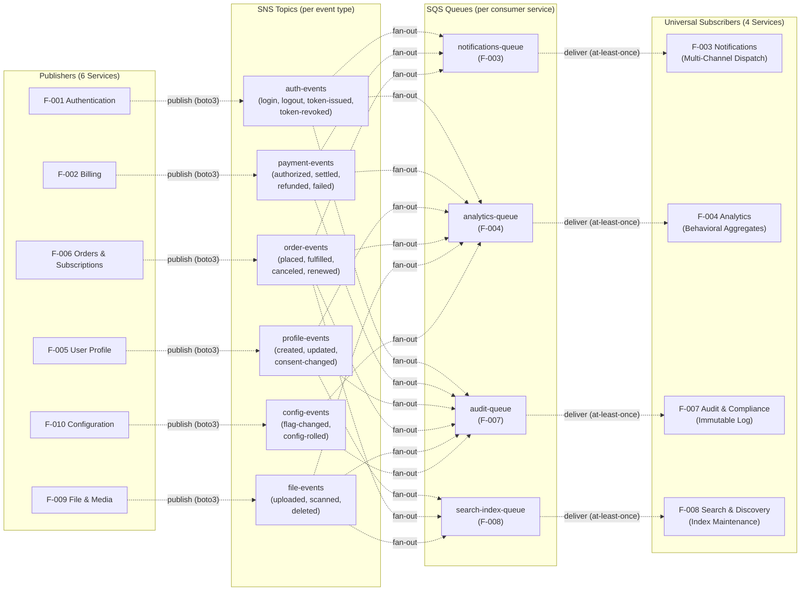
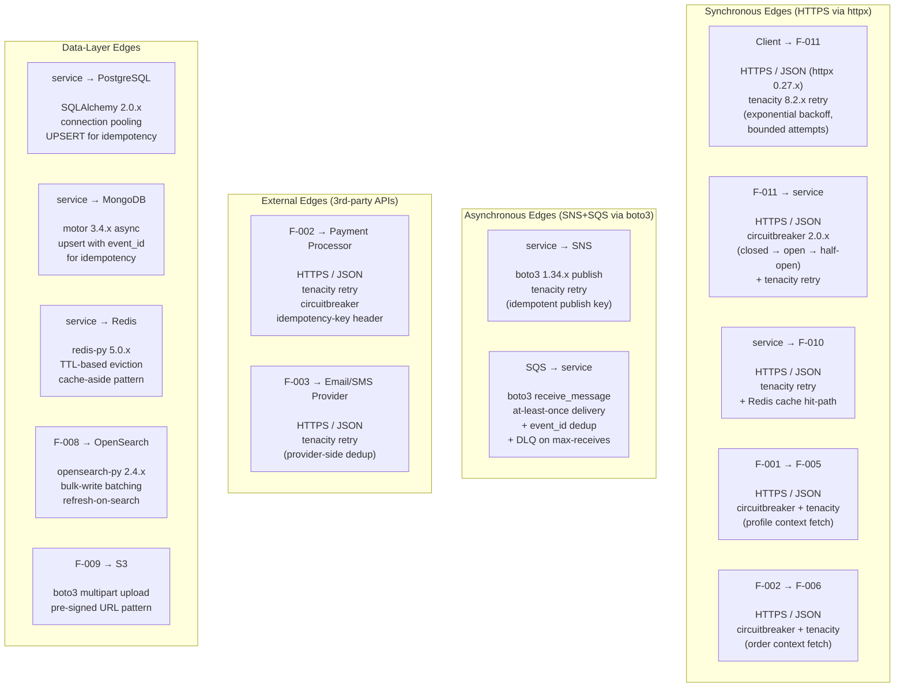

# Microservices Architecture

This document is the canonical architectural illustration of the platform's large-scale microservices system. It visualizes the **eleven first-class services** (`F-001` Authentication through `F-011` API Gateway, with `F-012` Service Discovery and `F-013` Event Messaging shown as the architectural elements they are), their **polyglot persistence bindings** (PostgreSQL, MongoDB, OpenSearch, Redis, S3), the **event backbone** (SNS topics fanning out to per-service SQS queues), the **external integration seams** (payment processor, email/SMS provider, third-party APIs), and the **dense interconnection** between them. Per the platform's scope declaration, the system is **backend-only** — no in-scope user interface is rendered, and every visual artifact in this file documents service-to-service topology rather than a graphical user experience.

The architecture rests on four reinforcing value pillars: **Independent Scalability** (each service scales on its own dimensions, sized to its own traffic profile), **Operational Resilience** (every cross-boundary edge is wrapped with retry, circuit breaker, and idempotency policies), **Delivery Velocity** (database-per-service decoupling and event-driven integration enable parallel team workflows), and **Data Strategy Flexibility** (polyglot persistence binds each service to the engine that best fits its access pattern). These pillars frame every architectural decision visualized below.

The diagrams in this document render natively in GitHub-flavored Markdown, GitLab, and every common IDE Markdown previewer that supports Mermaid. Each diagram is a self-contained Mermaid block — readers can copy any block into the [Mermaid Live Editor](https://mermaid.live/) for interactive exploration. Three diagrams are presented: a primary end-to-end architecture diagram, a complementary "Event Bus Fan-Out" detail that zooms in on the SNS-topic / SQS-queue routing mesh, and a complementary "Per-Boundary Resilience" detail that surfaces where retry, circuit breaker, and idempotency policies wrap each integration edge.

## Visual Conventions

The following visual vocabulary is used uniformly across every diagram in this document. The conventions match the broader Technical Specification's diagrammatic style (Sections 5.1.1.3, 5.2.6, 6.3.2.7, 6.3.6) and are restated here so readers do not need to consult the Mermaid syntax reference to interpret the diagrams.

- `-->` **Solid arrow** — synchronous HTTPS REST request/response transiting `F-011 API Gateway` (or one of the three architecturally-permitted service-to-service synchronous edges).
- `-. "label" .->` **Dotted arrow** — asynchronous publish/subscribe transiting `F-013 SNS+SQS` (publisher publishes to an SNS topic; SNS fans out to per-service SQS queues; consumers receive at-least-once delivery).
- `<-->` **Bidirectional arrow** — a synchronous round-trip whose return path carries architecturally-significant payload (used for the gateway↔auth token-validation symmetry on every authenticated request).
- `[Name]` **Rectangle** — a service, gateway, queue, topic, or other process node.
- `[(Name)]` **Cylinder** — a persistence store (relational database, document database, search index, cache, or object store).
- `subgraph Id["Display Label"]` — an architectural tier or grouping (Frontend / Backend / Infrastructure at the top level; Edge Layer / Microservices Layer / Event Backbone / Data Layer / External Systems as nested groupings).
- `%%`-prefixed lines — annotations visible only in the source markdown; they do not appear in the rendered SVG but provide an inline second layer of documentation explaining each subgraph's or edge cluster's intent.

Edge labels (the text immediately following `|` or between `-.` and `.->`) describe the protocol, library, or qualitative property of the edge — for example `"token validation round-trip"`, `"publish (boto3)"`, `"deliver (at-least-once)"`, `"config fetch"`. Numerical service-level objectives (specific latency budgets, RPS caps, retry counts) are intentionally omitted from every label per the platform's documentation conventions; only qualitative properties (`at-least-once`, `idempotent`, `bounded retry`) appear.

## Primary Architecture Diagram

The diagram below is the canonical, end-to-end visualization of the platform. It satisfies the "10+ services, REST + async messaging, per-service databases, external systems, frontend/backend/infrastructure subgraph grouping, bidirectional + conditional flows, long node labels and annotations, dense interconnection" requirements set out in the Agent Action Plan. It contains eleven first-class service nodes, five persistence engines, the SNS+SQS event backbone, three external-system adapter seams, and approximately fifty-two architecturally-permitted edges enumerated in Sections 5.1.3.2 and 6.3.3.1 of the Technical Specification.

```mermaid
flowchart TB
    %% Primary architecture: 11 first-class services, polyglot persistence, SNS+SQS event backbone, external adapter seams.
    %% Solid arrows encode synchronous HTTPS via F-011 API Gateway. Dotted arrows encode asynchronous publish/subscribe via F-013 SNS+SQS.
    %% No client traffic bypasses F-011 (ADR-012). No service touches another service's database (ADR-011). Service boundaries follow ADR-010.

    %% =========================================================================
    %% Frontend tier: external clients only; HTTPS to F-011 only; ADR-012 forbids bypass
    %% =========================================================================
    subgraph Frontend["Frontend (Client Tier)"]
        Web["Web &amp; Mobile<br/>Clients<br/>(Browsers, Native Apps)"]
        Partner["Partner /<br/>API Consumers<br/>(B2B Integrations)"]
        Ops["Operations<br/>Console<br/>(Internal Tooling)"]
    end

    %% =========================================================================
    %% Backend tier: edge layer plus all 10 domain microservices (F-001 .. F-010)
    %% Edge Layer = F-011 single ingress + F-012 service discovery
    %% Microservices Layer = the 10 independently deployable domain services
    %% =========================================================================
    subgraph Backend["Backend (Edge &amp; Microservices)"]
        subgraph Edge["Edge Layer"]
            GW["F-011 API Gateway<br/>HTTPS / JSON<br/>Single Ingress<br/>AuthN / AuthZ / Rate / Routing"]
            SD["F-012 Service Discovery<br/>Cloud Map / CoreDNS<br/>Logical-name resolution"]
        end
        subgraph Services["Microservices Layer (10 Services)"]
            F1["F-001 Authentication<br/>Credentials, Tokens,<br/>Sessions, RBAC<br/>(PyJWT + argon2)"]
            F2["F-002 Billing<br/>Plans, Invoices,<br/>Idempotent Authorization,<br/>Settlement"]
            F3["F-003 Notifications<br/>Multi-Channel Dispatch<br/>(Email / SMS / Push)"]
            F4["F-004 Analytics<br/>Behavioral Events,<br/>Aggregates, Reports"]
            F5["F-005 User Profile<br/>Identity Attributes,<br/>Preferences, Consent"]
            F6["F-006 Orders &amp; Subscriptions<br/>Lifecycle State Machine,<br/>Cancellations, Renewals"]
            F7["F-007 Audit &amp; Compliance<br/>Immutable Event Log,<br/>Retention, Forensics"]
            F8["F-008 Search &amp; Discovery<br/>Full-Text + Faceted<br/>Indexing &amp; Query"]
            F9["F-009 File &amp; Media<br/>Uploads, Metadata,<br/>Pre-Signed URLs"]
            F10["F-010 Configuration<br/>Feature Flags,<br/>Bootstrap Config"]
        end
    end

    %% =========================================================================
    %% Infrastructure tier: event backbone, polyglot data layer, external adapter seams
    %% Event Backbone = F-013 SNS+SQS
    %% Data Layer = polyglot persistence per TS Section 5.1.2.1
    %% External Systems = adapter seams owned by their consuming service (TS 6.3.4.1)
    %% =========================================================================
    subgraph Infrastructure["Infrastructure (Event Backbone, Data, External)"]
        subgraph EventBus["Event Backbone (F-013)"]
            SNS["SNS Topics<br/>per event type<br/>(at-least-once publish)"]
            SQS["SQS Queues<br/>per consumer service<br/>(at-least-once deliver + DLQ)"]
        end
        subgraph Data["Data Layer (Polyglot Persistence)"]
            PG[("PostgreSQL 15.x<br/>RDS<br/>(F-001, F-002, F-005,<br/>F-006, F-010)")]
            Mongo[("MongoDB 7.0.x<br/>DocumentDB<br/>(F-003, F-004,<br/>F-007, F-009)")]
            OS[("OpenSearch 2.11.x<br/>(F-008)")]
            Redis[("Redis 7.2.x<br/>ElastiCache<br/>(F-001 sessions,<br/>F-010 hot cache)")]
            S3[("Amazon S3<br/>(F-009 binary payloads)")]
        end
        subgraph External["External Systems (Adapter Seams)"]
            Pay["Payment Processor<br/>(adapter inside F-002)<br/>HTTPS / JSON"]
            Email["Email / SMS Provider<br/>(adapter inside F-003)<br/>HTTPS / JSON"]
            ThirdParty["Third-Party APIs<br/>(future adapter seams)<br/>HTTPS / JSON"]
        end
    end

    %% =========================================================================
    %% Synchronous client -> gateway edges (3 edges)
    %% Every client goes through F-011 only; ADR-012 bans any direct client->service edge.
    %% =========================================================================
    Web --> GW
    Partner --> GW
    Ops --> GW

    %% =========================================================================
    %% Gateway -> service discovery edge (1 edge)
    %% F-011 resolves logical service names via F-012 before forwarding any request.
    %% =========================================================================
    GW --> SD

    %% =========================================================================
    %% Bidirectional gateway <-> auth edge (1 edge)
    %% F-011 calls F-001 to validate every Bearer token before forwarding to any downstream service.
    %% This is the single architecturally-significant round-trip on every authenticated request.
    %% =========================================================================
    GW <-->|"token validation<br/>round-trip"| F1

    %% =========================================================================
    %% Gateway -> other-service synchronous edges (8 edges)
    %% F-011 forwards authenticated, authorized requests to the appropriate microservice.
    %% F-007 Audit is async-subscribe-only (no synchronous ingress) per TS Section 6.3.3.1.2.
    %% =========================================================================
    GW --> F2
    GW --> F3
    GW --> F4
    GW --> F5
    GW --> F6
    GW --> F8
    GW --> F9
    GW --> F10

    %% =========================================================================
    %% Permitted service-to-service synchronous edges (per TS Section 5.1.3.2 / ADR-009)
    %% Only three classes of svc-to-svc sync edge are permitted:
    %%   1. F-001 -> F-005 for profile context
    %%   2. F-002 -> F-006 for order context
    %%   3. service -> F-010 for configuration bootstrap
    %% =========================================================================
    F1 -->|"profile context"| F5
    F2 -->|"order context"| F6

    %% =========================================================================
    %% Configuration bootstrap edges (9 edges, every non-config service -> F-010)
    %% Every service fetches feature flags / runtime config at startup and on TTL refresh.
    %% =========================================================================
    F1 -->|"config fetch"| F10
    F2 -->|"config fetch"| F10
    F3 -->|"config fetch"| F10
    F4 -->|"config fetch"| F10
    F5 -->|"config fetch"| F10
    F6 -->|"config fetch"| F10
    F7 -->|"config fetch"| F10
    F8 -->|"config fetch"| F10
    F9 -->|"config fetch"| F10

    %% =========================================================================
    %% Asynchronous publisher -> SNS edges (6 dotted edges, per TS Section 6.3.3.1.1)
    %% Every state-changing event publishes to SNS; SQS guarantees at-least-once consumer delivery.
    %% F-007 Audit and F-003 Notifications are subscribe-only (they do not publish).
    %% =========================================================================
    F1 -. "publish auth events" .-> SNS
    F2 -. "publish payment events" .-> SNS
    F5 -. "publish profile events" .-> SNS
    F6 -. "publish lifecycle events" .-> SNS
    F9 -. "publish file events" .-> SNS
    F10 -. "publish config events" .-> SNS

    %% =========================================================================
    %% SNS -> SQS fan-out edge (1 dotted edge)
    %% SNS topics fan out to per-consumer SQS queues; the per-topic, per-queue mesh is
    %% rendered in the Event Bus Fan-Out Detail diagram below.
    %% =========================================================================
    SNS -. "fan-out" .-> SQS

    %% =========================================================================
    %% SQS -> universal subscriber edges (4 dotted edges, per TS Section 6.3.3.1.2)
    %% F-003, F-004, F-007 are universal subscribers to all event topics.
    %% F-008 subscribes only to change events for index maintenance.
    %% =========================================================================
    SQS -. "deliver (at-least-once)" .-> F3
    SQS -. "deliver (at-least-once)" .-> F4
    SQS -. "deliver (at-least-once)" .-> F7
    SQS -. "deliver (change events)" .-> F8

    %% =========================================================================
    %% Service -> persistence edges (13 edges, per TS Section 5.1.2.1)
    %% Database-per-service: every service owns its own schema in its own engine (ADR-011).
    %% No service reaches into another service's persistence node.
    %% =========================================================================
    F1 --> PG
    F1 --> Redis
    F2 --> PG
    F5 --> PG
    F6 --> PG
    F10 --> PG
    F10 --> Redis
    F3 --> Mongo
    F4 --> Mongo
    F7 --> Mongo
    F9 --> Mongo
    F9 --> S3
    F8 --> OS

    %% =========================================================================
    %% External-systems adapter-seam edges (4 edges, per TS Section 6.3.4.1)
    %% Each external integration is owned by exactly one service; the service hosts the adapter.
    %% No specific vendor is named per TS Section 1.3.2.1.
    %% =========================================================================
    F2 --> Pay
    F2 -. "retry on 5xx" .-> Pay
    F3 --> Email
    F1 --> ThirdParty
```

## Event Bus Fan-Out Detail

The primary diagram above collapses the entire SNS-topic / SQS-queue routing mesh into a single `SNS -> SQS` edge for visual clarity. The diagram below zooms in on that mesh, rendering every per-event SNS topic, every per-consumer SQS queue, and every fan-out edge between them. This is the canonical visualization of the platform's asynchronous integration topology — the mesh that decouples publishers from subscribers and that delivers the universal-subscriber pattern of Section 6.3.3.1.2.

Every consumer queue is configured with a per-message visibility timeout sized for the consumer's handler latency plus headroom; consumers are expected to deduplicate on a message-level `event_id` to guarantee idempotent processing under at-least-once delivery semantics. Messages that exceed the maximum-receive count are routed to the corresponding dead-letter queue (DLQ) for forensic inspection and replay. See Section 6.3.3 of the Technical Specification for the full event-processing contract.

## Per-Boundary Resilience Detail

The diagram below surfaces where the platform's resilience policies — `tenacity` retry with exponential backoff, `circuitbreaker` open/half-open/closed state transitions, and idempotency-key deduplication — wrap each cross-boundary integration edge. This level of detail would have made the primary diagram unreadable, so it is rendered separately. Every cross-boundary edge in the platform is wrapped by at least one resilience policy; idempotency is achieved through a combination of provider-side deduplication (where supported), consumer-side `event_id` dedup, and idempotency-key headers on POSTs.

Every cross-boundary edge in the platform is wrapped by at least one of the policies above. Synchronous service-to-service calls combine `tenacity` retry with `circuitbreaker` to fail fast when a downstream is degraded; asynchronous publish/subscribe paths combine `tenacity` retry on the publish side with at-least-once delivery and `event_id` dedup on the subscribe side; external API calls layer in idempotency-key headers when the provider supports them. See Section 6.3.3.5.2 of the Technical Specification for the per-boundary policy specification, including the qualitative retry/backoff and circuit-breaker-state contracts.

## Reading the Diagram

The primary architecture diagram is organized into three top-level subgraphs that match the user's preferred frontend / backend / infrastructure mental model. The **Frontend** subgraph contains only client-facing nodes (browsers and mobile apps, partner API consumers, the operations console). All client traffic enters the platform through the single ingress at `F-011 API Gateway` — there are no direct edges from a client node to a microservice node, in keeping with the "no gateway bypass" rule (ADR-012). The **Backend** subgraph contains the edge layer (`F-011` API Gateway plus `F-012` Service Discovery) plus the ten domain microservices `F-001` through `F-010` arranged in the Microservices Layer. The **Infrastructure** subgraph contains the event backbone (SNS topics plus SQS queues, collectively `F-013`), the polyglot persistence layer (PostgreSQL on RDS, MongoDB on DocumentDB, OpenSearch, Redis on ElastiCache, and Amazon S3 for binary payloads), and the external-system adapter seams (the payment processor consumed by `F-002`, the email/SMS provider consumed by `F-003`, and the third-party APIs category consumed by `F-001` and any future seam owners).

Edges encode integration semantics. **Solid arrows** (`-->`) carry synchronous HTTPS REST traffic — the gateway's request-response chain plus the three architecturally-permitted classes of service-to-service synchronous call (`F-001 -> F-005` for profile context, `F-002 -> F-006` for order context, and every service `-> F-010` for configuration bootstrap). **Dotted arrows** (`-. label .->`) carry asynchronous publish/subscribe traffic — every state-changing event flows from its publisher to an SNS topic, fans out to per-service SQS queues, and is consumed by the universal subscribers (`F-003` Notifications, `F-004` Analytics, `F-007` Audit, plus `F-008` Search for change events). The single **bidirectional** edge (`<-->` between `F-011` and `F-001`) emphasizes that token validation is the sole gateway-to-auth round-trip on every authenticated request — every other gateway-to-service edge is a one-way request/response per the standard HTTPS semantics. **Cylinder shapes** (`[(...)]`) indicate persistence stores; every microservice in the Backend tier has at least one outgoing edge to a cylinder in the Data Layer, satisfying the database-per-service mandate (ADR-011). Subgraph boundaries encode tier membership; nested subgraphs inside `Backend` separate the Edge Layer from the Microservices Layer, and nested subgraphs inside `Infrastructure` separate the Event Backbone from the Data Layer from the External Systems boundary.

The two complementary diagrams refine specific concerns without overcrowding the primary diagram. The **Event Bus Fan-Out Detail** shows the per-topic / per-queue routing mesh that the primary diagram collapses into a single `SNS -> SQS` edge — readers who want to see exactly which event topic delivers to which consumer queue should consult that diagram. The **Per-Boundary Resilience Detail** shows where `tenacity` retry, `circuitbreaker`, and idempotency-key policies wrap each cross-boundary edge — readers debugging a transient failure or designing a new adapter seam should consult that diagram for the canonical resilience pattern at each integration class. For canonical request-flow walk-throughs (the Login flow and the Payment processing flow, including conditional branching and parallel post-settlement fan-out), see the standalone sequence diagrams under [`sequence-diagrams/`](sequence-diagrams/).

## See Also

- [`README.md`](README.md) — Architecture documentation index (this directory's landing page).
- [`sequence-diagrams/login-flow.md`](sequence-diagrams/login-flow.md) — Mermaid sequence diagram for the user Login flow, including the `alt` / `else` branch for credential validity and the asynchronous fan-out to `F-007` Audit.
- [`sequence-diagrams/payment-flow.md`](sequence-diagrams/payment-flow.md) — Mermaid sequence diagram for the Payment processing flow, including nested `alt` / `else` branches for RBAC permit/deny and authorization succeed/fail, plus a `par` / `and` block for the parallel post-settlement fan-out to `F-003` Notifications, `F-007` Audit, and `F-004` Analytics.
- [Repository root `README.md`](../../README.md) — Top-level project landing page with cross-links back into this architecture documentation.
