# Login Sequence Diagram

This document is the canonical Mermaid sequence diagram for the platform's user Login flow. It traces a credential-submission request from a human Client through `F-011 API Gateway`, the synchronous chain of `F-012 Service Discovery` (resolving the auth backend), `F-001 Authentication` (credential verification, token issuance, session creation), and `F-005 User Profile` (profile context lookup), backed by PostgreSQL (credential and session storage) and Redis (session-lookup cache), with a conditional `alt`/`else` branch for credential validity and a post-issuance asynchronous fan-out to `F-007 Audit & Compliance` through `F-013 SNS+SQS` (with the audit event durably persisted to MongoDB). The diagram aligns exactly with Technical Specification Sections 4.3.1 (Login Sequence Diagram) and 5.2.7.1 (Detailed Login Flow), and reuses the canonical service identifiers and persistence-engine bindings established in Sections 2.1.2 and 5.1.2.1.

## Diagram

The block below is a self-contained Mermaid `sequenceDiagram` — readers can copy it into the [Mermaid Live Editor](https://mermaid.live/) for interactive exploration. Synchronous request/response interactions use solid arrows (`->>`) with activation/deactivation markers (`->>+` / `-->>-`); dashed arrows (`-->>`) mark synchronous responses; the `alt`/`else`/`end` block captures the credential-validity branch; the asynchronous SQS-delivery section sits intentionally **outside** the alt block to convey that the fan-out runs after the synchronous response has been returned to the Client. Every step is annotated with its originating requirement identifier (`F-XXX-RQ-YYY`) so the diagram is traceable to the Functional Requirements catalog of Section 2.2.

```mermaid
sequenceDiagram
    %% Login flow per TS Section 4.3.1 / Section 5.2.7.1.
    %% Synchronous credential-verification chain with a conditional branch
    %% on credential validity, plus asynchronous fan-out to F-007 Audit
    %% through F-013 SNS+SQS for compliance retention.
    %% Two integration pathways only: synchronous via F-011 (plus the
    %% architecturally-permitted F-001 -> F-005 svc-to-svc edge per TS
    %% Section 5.1.3.2) and asynchronous via F-013 (TS Section 6.3.3.1.1).

    actor Client as Web / Mobile Client
    participant GW as F-011 Gateway
    participant SD as F-012 Discovery
    participant Auth as F-001 Authentication
    participant Profile as F-005 User Profile
    participant SQL as PostgreSQL
    participant Cache as Redis
    participant MQ as F-013 SNS / SQS
    participant Audit as F-007 Audit
    participant DocDB as MongoDB

    %% ---------------------------------------------------------------------
    %% Phase 1: Synchronous credential-verification chain.
    %% Client submits credentials via HTTPS to the single ingress at F-011.
    %% F-011 resolves the F-001 Authentication backend through F-012, then
    %% forwards the credentials. F-001 reads the credential record from
    %% PostgreSQL and verifies the password using a constant-time argon2
    %% comparison in-process.
    %% ---------------------------------------------------------------------
    Note over Client, GW: Client submits credentials via HTTPS to the single ingress at F-011

    Client->>+GW: POST /auth/login<br/>(credentials, F-011-RQ-002)
    GW->>+SD: Resolve F-001 Authentication backend (F-011-RQ-003)
    SD-->>-GW: Endpoint resolution
    GW->>+Auth: Forward credentials (F-011-RQ-002, F-011-RQ-003)
    Auth->>+SQL: SELECT credential row by username
    SQL-->>-Auth: Credential record
    Auth->>Auth: argon2 verify (F-001-RQ-001)

    %% ---------------------------------------------------------------------
    %% Phase 2: Conditional branch on credential validity.
    %% Credentials Invalid -> HTTP 401 propagates back to the Client.
    %% Credentials Valid -> F-001 -> F-005 fetches profile context (the only
    %% architecturally-permitted svc-to-svc synchronous edge in this flow,
    %% per TS Section 5.1.3.2). Auth then persists the issued token and the
    %% session record to PostgreSQL, populates the Redis session-lookup cache
    %% with TTL eviction (F-001-RQ-005, the lever that keeps the gateway
    %% token-validation round-trip fast on subsequent authenticated calls),
    %% publishes the auth-success event to F-013, and finally returns the
    %% Bearer token to the Client. The publish-then-respond ordering ensures
    %% the audit event is durable before the Client receives its token.
    %% ---------------------------------------------------------------------
    alt Credentials Invalid
        Auth-->>GW: HTTP 401 Unauthorized
        GW-->>Client: HTTP 401 Unauthorized
    else Credentials Valid
        Auth->>+Profile: Get profile context (F-005-RQ-003)
        Profile->>SQL: SELECT profile attributes
        Profile-->>-Auth: Profile attributes (preferences, consent)
        Auth->>SQL: INSERT token (F-001-RQ-002)
        Auth->>SQL: INSERT session (F-001-RQ-003)
        Auth->>Cache: SET session lookup (TTL, F-001-RQ-005)
        Auth->>MQ: Publish auth-success event (F-001-RQ-002)
        Auth-->>GW: Bearer token + profile context
        GW-->>Client: HTTP 200 + Bearer Token
    end
    %% Deactivate Auth and GW once after the alt/else block.
    %% Mermaid linearly tracks activation state across both branches, so
    %% pairing every "->>+" with a single "deactivate" keyword (rather than
    %% inline "-->>-" deactivation markers in each branch) is the canonical
    %% way to keep activation bookkeeping balanced when both branches reply.
    deactivate Auth
    deactivate GW

    %% ---------------------------------------------------------------------
    %% Phase 3: Asynchronous fan-out to F-007 Audit (universal subscriber).
    %% This block runs after the synchronous response has already been
    %% returned to the Client. F-007 consumes the auth event from its
    %% SQS queue (at-least-once delivery) and writes an immutable record
    %% to its MongoDB store for compliance retention. F-007 is the only
    %% subscriber relevant to a Login flow because Login is not a state-
    %% changing event for Notifications or Analytics; the wider universal-
    %% subscriber fan-out (F-003, F-004, F-008) is shown in the Payment
    %% sequence diagram and in the primary architecture diagram.
    %% ---------------------------------------------------------------------
    Note over MQ, DocDB: Asynchronous fan-out: F-007 Audit consumes the auth event for compliance retention

    MQ->>+Audit: Deliver auth event (F-007-RQ-001, at-least-once)
    Audit->>DocDB: INSERT immutable record (F-007-RQ-002)
    Audit-->>-MQ: ack
```

## Annotations

The diagram annotates each step with the originating requirement identifier from Technical Specification Section 2.2 (Functional Requirements). The mapping is:

- **F-011-RQ-002**: API Gateway forwards authenticated and unauthenticated routes to the correct downstream microservice; the `/auth/login` route is configured to forward to F-001 Authentication.
- **F-011-RQ-003**: API Gateway resolves backend endpoints through F-012 Service Discovery (Cloud Map / CoreDNS) before forwarding requests, with cached resolutions for low-latency repeat calls.
- **F-001-RQ-001**: Authentication verifies the submitted password against the stored argon2 hash using a constant-time comparison.
- **F-001-RQ-002**: Authentication issues a Bearer token (signed JWT) to a successfully authenticated client and publishes an auth-success event for downstream consumption.
- **F-001-RQ-003**: Authentication persists a session record in PostgreSQL upon successful login, capturing the issued token's identifier, the user identifier, the session expiration, and request metadata.
- **F-001-RQ-005**: Authentication maintains a Redis cache of session-lookup keys with TTL eviction for fast session validation on subsequent authenticated requests, avoiding a PostgreSQL round-trip on the hot path.
- **F-005-RQ-003**: User Profile returns profile attributes (preferences, consent state) to authorized callers via the architecturally permitted F-001 → F-005 synchronous edge defined in TS Section 5.1.3.2.
- **F-007-RQ-001**: Audit & Compliance consumes the auth event from its SQS queue (universal-subscriber pattern per TS Section 6.3.3.1.2).
- **F-007-RQ-002**: Audit & Compliance writes an immutable record of the auth event to its MongoDB store for compliance retention.

### Persistence-Engine Qualifiers

The diagram uses the short engine names `PostgreSQL`, `Redis`, and `MongoDB` for visual brevity. Their canonical, fully-qualified deployment forms (per TS Section 5.1.2.1 and TS Section 9.1.6.2) are:

- `PostgreSQL` — **PostgreSQL 15.x on Amazon RDS** — owned by F-001 (credentials, sessions, refresh tokens) and shared in this flow with F-005 (profile attributes), each in its own database-per-service schema (ADR-011).
- `Redis` — **Redis 7.2.x on Amazon ElastiCache** — owned by F-001 for session-lookup caching with TTL eviction.
- `MongoDB` — **MongoDB 7.0.x on Amazon DocumentDB** — owned by F-007 for the immutable audit log.

### Cross-References

For the canonical narrative of this flow, see Technical Specification Sections 4.3.1 (Login Sequence Diagram) and 5.2.7.1 (Detailed Login Flow). For the broader topology that contextualizes every node and edge in this diagram, see [`../microservices-architecture.md`](../microservices-architecture.md). For the more complex sequence diagram that exercises nested conditional branches and a parallel fan-out, see [`payment-flow.md`](payment-flow.md).

---

← [Back to architecture documentation](../README.md)  |  [Payment flow](payment-flow.md)  |  [Primary architecture diagram](../microservices-architecture.md)
