# Payment Processing Sequence Diagram

This document is the canonical Mermaid sequence diagram for the platform's Payment processing flow. It traces a payment request from a human Client through `F-011 API Gateway`, the synchronous chain of `F-001 Authentication` (Bearer token signature verification + Redis-backed session-cache lookup + RBAC scope enforcement), `F-002 Billing` (idempotent invoice persistence, payment-processor authorization, settlement record), and `F-006 Orders & Subscriptions` (order context lookup over the architecturally permitted F-002 → F-006 svc-to-svc edge), all backed by PostgreSQL persistence, then renders the post-settlement parallel asynchronous fan-out through `F-013 SNS+SQS` to the universal subscribers `F-003 Notifications`, `F-007 Audit & Compliance`, and `F-004 Analytics` (each with its own per-service SQS queue and its own MongoDB-on-DocumentDB store). The diagram visualizes the two stacked conditional decision points required by the flow — RBAC permit/deny at the outer level and authorization-succeeds/authorization-fails nested within RBAC permit — plus the parallel post-settlement fan-out that runs after the synchronous response has been returned to the Client. It aligns exactly with Technical Specification Sections 4.3.2 (Payment Sequence Diagram) and 5.2.7.2 (Detailed Payment Flow), and reuses the canonical service identifiers and persistence-engine bindings established in Sections 2.1.2 and 5.1.2.1.

## Diagram

The block below is a self-contained Mermaid `sequenceDiagram` — readers can copy it into the [Mermaid Live Editor](https://mermaid.live/) for interactive exploration. Synchronous request/response interactions use solid arrows (`->>`) with activation/deactivation markers (`->>+` / `-->>-`); dashed arrows (`-->>`) mark synchronous responses; the outer `alt`/`else`/`end` block captures the RBAC permit/deny decision and the inner `alt`/`else`/`end` block captures the authorization-succeeds/authorization-fails decision; the `par`/`and`/`end` block at the bottom captures the parallel asynchronous fan-out to the three universal subscribers; the `Note over` markers introduce each phase of the flow. Every step is annotated with its originating requirement identifier (`F-XXX-RQ-YYY`) so the diagram is traceable to the Functional Requirements catalog of Section 2.2.

```mermaid
sequenceDiagram
    %% Payment processing flow per TS Section 4.3.2 / Section 5.2.7.2.
    %% Synchronous request/response with NESTED conditional branches:
    %%   - Outer alt: RBAC Denies vs. RBAC Allows (F-001 enforces scope).
    %%   - Inner alt: Authorization Fails vs. Authorization Succeeds (F-002
    %%     calls the configured payment processor inside the Allows branch).
    %% Followed by a par/and/end parallel asynchronous fan-out via F-013
    %% to the three universal subscribers F-003, F-007, F-004 — each with
    %% its own per-service SQS queue per the universal-subscriber pattern
    %% of TS Section 6.3.3.1.2 and the event topology of Section 6.3.3.1.1.
    %% Two integration pathways only: synchronous via F-011 (plus the single
    %% architecturally-permitted F-002 -> F-006 svc-to-svc edge per TS
    %% Section 5.1.3.2) and asynchronous via F-013 (TS Section 6.3.3.1.1).

    actor Client as Web / Mobile Client
    participant GW as F-011 Gateway
    participant Auth as F-001 Authentication
    participant Bill as F-002 Billing
    participant Ord as F-006 Orders
    participant SQL as PostgreSQL
    participant MQ as F-013 SNS / SQS
    participant Notif as F-003 Notifications
    participant DocDB as MongoDB
    participant Audit as F-007 Audit
    participant Anly as F-004 Analytics

    %% ---------------------------------------------------------------------
    %% Phase 1: Synchronous request and Bearer-token validation.
    %% Client submits a payment request to the single ingress at F-011.
    %% The HTTP request carries an Authorization: Bearer header issued by
    %% F-001 during a prior Login flow (see login-flow.md) and an
    %% Idempotency-Key header that F-002 will use to ensure that retries
    %% of a transient network failure do not double-charge. F-011 forwards
    %% to F-001, which verifies the JWT signature in-process and then
    %% consults the Redis-backed session cache (F-001-RQ-005) for fast
    %% revocation/RBAC checks before returning Allow/Deny to F-011.
    %% ---------------------------------------------------------------------
    Note over Client, GW: Client submits a payment with Bearer token + Idempotency-Key header

    Client->>+GW: POST /payments<br/>Bearer + Idempotency-Key (F-011-RQ-002)
    GW->>+Auth: Validate token + RBAC (F-001-RQ-004)
    Auth->>Auth: Verify JWT signature + check Redis session cache (F-001-RQ-004)
    Auth-->>-GW: Allow / Deny

    %% ---------------------------------------------------------------------
    %% Phase 2: Outer conditional branch on the RBAC decision.
    %% RBAC Denies -> F-011 returns HTTP 403 directly to the Client; the
    %% request never reaches F-002 and no invoice/authorization/settlement
    %% records are written. Both GW and the request lifecycle terminate.
    %% RBAC Allows -> F-011 forwards the request to F-002 Billing. F-002
    %% calls F-006 Orders & Subscriptions for the order's lifecycle context
    %% (the only architecturally permitted svc-to-svc synchronous edge in
    %% this flow per TS Section 5.1.3.2). F-002 then writes the invoice
    %% and the idempotent authorization-attempt record to PostgreSQL,
    %% keyed by the client's Idempotency-Key header so that retries of
    %% transient failures are safely deduplicated (F-002-RQ-003).
    %% ---------------------------------------------------------------------
    alt RBAC Denies
        GW-->>Client: HTTP 403 Forbidden
    else RBAC Allows
        GW->>+Bill: Forward request (F-011-RQ-002)
        Bill->>+Ord: Get order context (F-006-RQ-003)
        Ord->>SQL: SELECT order row
        Ord-->>-Bill: Order context (lifecycle state)
        Bill->>SQL: INSERT invoice (F-002-RQ-002)
        Bill->>SQL: UPSERT authorization (F-002-RQ-003 idempotent)

        %% -----------------------------------------------------------------
        %% Phase 3: Inner conditional branch on authorization outcome.
        %% Authorization Fails -> F-002 publishes an authorization-failed
        %% event (F-002-RQ-003) for asynchronous downstream awareness, then
        %% returns a failure response to F-011, which surfaces HTTP 402
        %% Payment Required to the Client. No settlement record is written
        %% and no settlement event is published; the failed-authorization
        %% event itself is the durable record of the failed attempt.
        %% Authorization Succeeds -> F-002 publishes the authorization-
        %% succeeded event (F-002-RQ-003), then writes the settlement
        %% record to PostgreSQL (F-002-RQ-004), then publishes the
        %% settlement event to F-013 (F-002-RQ-005). The two distinct
        %% events have distinct downstream semantic meaning: authorization-
        %% succeeded indicates "the configured payment processor accepted
        %% the charge"; settlement indicates "the funds movement was
        %% recorded" and is the trigger for the universal-subscriber
        %% fan-out of Phase 4. F-002 then returns confirmation to F-011,
        %% which surfaces HTTP 200 + Receipt to the Client.
        %% -----------------------------------------------------------------
        alt Authorization Fails
            Bill->>MQ: Publish authorization-failed event (F-002-RQ-003)
            Bill-->>GW: Authorization failure response
            GW-->>Client: HTTP 402 Payment Required
        else Authorization Succeeds
            Bill->>MQ: Publish authorization-succeeded event (F-002-RQ-003)
            Bill->>SQL: INSERT settlement (F-002-RQ-004)
            Bill->>MQ: Publish settlement event (F-002-RQ-005)
            Bill-->>GW: Settlement confirmation
            GW-->>Client: HTTP 200 + Receipt
        end
        %% Deactivate Bill once after the inner alt/end. Mermaid linearly
        %% tracks activation state across both branches, so pairing the
        %% single "GW->>+Bill" with a single "deactivate Bill" (rather than
        %% inline "-->>-" deactivation markers in each branch) is the
        %% canonical way to keep activation bookkeeping balanced when
        %% both branches reply.
        deactivate Bill
    end
    %% Deactivate GW once after the outer alt/end for the same reason:
    %% GW was activated once at request entry, and is replied-to in every
    %% branch (RBAC Denies: HTTP 403; Authorization Fails: HTTP 402;
    %% Authorization Succeeds: HTTP 200), so a single deactivate keyword
    %% after the outer end balances the original "Client->>+GW" activation.
    deactivate GW

    %% ---------------------------------------------------------------------
    %% Phase 4: Post-settlement parallel asynchronous fan-out.
    %% Once the synchronous response has been returned to the Client, F-013
    %% delivers the settlement event from the SNS topic to each universal
    %% subscriber's per-service SQS queue. The three subscribers consume
    %% IN PARALLEL and INDEPENDENTLY — a slow or failing consumer does
    %% not block the others, and each consumer's idempotent processing
    %% means the at-least-once delivery contract of TS Section 6.3.3.1.1
    %% is safe even when SQS redelivers a message after a transient failure.
    %% The par/and/end block below renders this parallelism explicitly:
    %%   - Notifications (F-003) renders and dispatches the user-facing
    %%     receipt across the recipient's preferred channels (email/SMS/
    %%     push), persisting the rendered notification to MongoDB.
    %%   - Audit & Compliance (F-007) writes an immutable record of the
    %%     settlement event to MongoDB for compliance retention.
    %%   - Analytics (F-004) upserts an aggregate document in MongoDB for
    %%     downstream reporting and dashboards.
    %% ---------------------------------------------------------------------
    Note over MQ, Anly: Post-settlement parallel asynchronous fan-out via SNS topic to per-subscriber SQS queues

    par Notifications branch
        MQ->>+Notif: Deliver settlement event (at-least-once)
        Notif->>DocDB: INSERT notification record (F-003-RQ-001)
        Notif->>Notif: Render and dispatch (F-003-RQ-002, F-003-RQ-003)
        Notif-->>-MQ: ack (F-003-RQ-005)
    and Audit branch
        MQ->>+Audit: Deliver settlement event (F-007-RQ-001)
        Audit->>DocDB: INSERT immutable audit record (F-007-RQ-002)
        Audit-->>-MQ: ack
    and Analytics branch
        MQ->>+Anly: Deliver settlement event (F-004-RQ-001)
        Anly->>DocDB: UPSERT aggregate document (F-004-RQ-002)
        Anly-->>-MQ: ack
    end
```

## Annotations

The diagram annotates each step with the originating requirement identifier from Technical Specification Section 2.2 (Functional Requirements). The mapping is:

- **F-011-RQ-002**: API Gateway forwards authenticated requests to the appropriate downstream microservice based on path-prefix routing; the `/payments` route is configured to forward to F-002 Billing after F-001 Authentication has returned an Allow decision.
- **F-001-RQ-004**: Authentication validates Bearer tokens (JWT signature verification) and enforces RBAC scope checks on every authenticated request, optionally consulting a Redis-backed session cache (F-001-RQ-005) for fast revocation checks so that the gateway-to-auth round-trip stays off the PostgreSQL hot path on subsequent calls.
- **F-006-RQ-003**: Orders & Subscriptions returns the requested order's lifecycle context (status, line items, billing terms) to authorized callers via the architecturally permitted F-002 → F-006 synchronous edge defined in TS Section 5.1.3.2; this is the single permitted svc-to-svc synchronous edge in this flow.
- **F-002-RQ-002**: Billing persists the invoice record in PostgreSQL.
- **F-002-RQ-003**: Billing performs idempotent authorization against the configured payment processor; the upsert is keyed by the client's `Idempotency-Key` header so that retries of transient network failures do not double-charge. Both the authorization-succeeded and the authorization-failed outcomes publish their own distinct event to F-013 for durable downstream awareness.
- **F-002-RQ-004**: Billing persists the settlement record in PostgreSQL after a successful authorization, recording the funds-movement entry that pairs with the authorization record.
- **F-002-RQ-005**: Billing publishes a settlement event to the F-013 SNS topic for asynchronous fan-out to the universal subscribers; this event is semantically distinct from the authorization-succeeded event of F-002-RQ-003.
- **F-003-RQ-001**: Notifications consumes the settlement event from its per-service SQS queue and persists a notification record in MongoDB keyed by the recipient and the event identifier.
- **F-003-RQ-002 / F-003-RQ-003**: Notifications renders the multi-channel dispatch (email / SMS / push) according to the recipient's preferences and channel availability, with channel-specific adapters owned inside F-003.
- **F-003-RQ-005**: Notifications acknowledges the SQS message after successful processing; failed messages are returned to the queue for redelivery and ultimately routed to a dead-letter queue per the at-least-once delivery contract of TS Section 6.3.3.1.1.
- **F-007-RQ-001**: Audit & Compliance consumes the settlement event from its per-service SQS queue (universal-subscriber pattern per TS Section 6.3.3.1.2).
- **F-007-RQ-002**: Audit & Compliance writes an immutable record of the settlement event to its MongoDB store for compliance retention; the record is append-only and is never updated or deleted.
- **F-004-RQ-001**: Analytics consumes the settlement event from its per-service SQS queue (universal-subscriber pattern per TS Section 6.3.3.1.2).
- **F-004-RQ-002**: Analytics updates its aggregate document store with the settlement event for downstream reporting and dashboards; aggregations are upserted (not appended) so that idempotent redelivery is safe.

### Persistence-Engine Qualifiers

The diagram uses the short engine names `PostgreSQL` and `MongoDB` for visual brevity. Their canonical, fully-qualified deployment forms (per TS Section 5.1.2.1 and TS Section 9.1.6.2) are:

- `PostgreSQL` — **PostgreSQL 15.x on Amazon RDS** — owned by F-002 (invoices, authorizations, settlements) and shared in this flow with F-006 (order rows), each in its own database-per-service schema (ADR-011). No cross-service database edges are rendered in the diagram; F-006's PostgreSQL access in the Orders branch is to F-006's own schema, not to F-002's.
- `MongoDB` — **MongoDB 7.0.x on Amazon DocumentDB** — owned independently by F-003 (notification records), F-007 (immutable audit log), and F-004 (analytics aggregates), again each in its own database-per-service deployment per ADR-011. The three subscribers do not share a database; the diagram's single `DocDB` participant is a visual abbreviation to avoid three separate near-identical participants.

### Conditional and Parallel Constructs

This diagram exercises the full set of Mermaid sequence-diagram control-flow constructs supported by the renderer:

- **Outer `alt`/`else`/`end`** — RBAC permit/deny. The denial branch returns HTTP 403 immediately; the permit branch enters the synchronous Billing chain.
- **Inner `alt`/`else`/`end`** (nested inside the RBAC permit branch) — authorization-succeeds/authorization-fails. The fail branch returns HTTP 402 and publishes only the authorization-failed event; the succeed branch publishes the authorization-succeeded event, persists the settlement, publishes the settlement event, and returns HTTP 200.
- **`par`/`and`/`end`** (after the alt blocks close) — three parallel branches for the universal subscribers F-003, F-007, F-004, each consuming the settlement event from its own SQS queue and persisting to MongoDB.

The `par` block sits intentionally **outside** the alt blocks to convey that the parallel fan-out runs after the synchronous response has been returned to the Client; it is therefore reachable only via the Authorization Succeeds branch. The diagram does not visualize a `par` fan-out for the Authorization Failed branch because that branch publishes a single authorization-failed event whose downstream fan-out is identical in shape to the settlement fan-out and is omitted for clarity (it is described in the primary architecture diagram's Event Bus Fan-Out detail).

### Cross-References

For the canonical narrative of this flow, see Technical Specification Sections 4.3.2 (Payment Sequence Diagram) and 5.2.7.2 (Detailed Payment Flow). For the broader topology that contextualizes every node and edge in this diagram — including the publisher-to-subscriber routing through SNS topics and SQS queues for both the authorization-succeeded and the settlement events — see [`../microservices-architecture.md`](../microservices-architecture.md). For the simpler companion sequence diagram that exercises a single-level conditional branch and a single-consumer asynchronous fan-out, see [`login-flow.md`](login-flow.md).

---

← [Back to architecture documentation](../README.md)  |  [Login flow](login-flow.md)  |  [Primary architecture diagram](../microservices-architecture.md)
